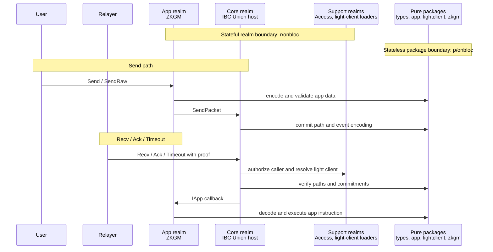

# Project Architecture

This document is a map of the first-party Gno packages and realms in this repository.\
It explains how the pure packages (`p/`) and stateful realms (`r/`) under the `onbloc` namespace fit together,\
what each one is responsible for, and how an IBC packet flows through them.

For per-module detail, follow the linked `README.md` of each component.\
For step-by-step lifecycle diagrams, see [Process Flows](process-flows.md).\
For spec-level comparisons against the upstream references, see the [Spec Comparisons](../README.md#spec-comparisons) section.

## Contracts

```
gno.land/
├── r/onbloc/ibc/                         # realms (stateful)
│   ├── union/
│   │   ├── core/                         # IBC Union core proxy
│   │   │   └── v1/                        #   └─ installed core implementation (ICore)
│   │   ├── lightclients/
│   │   │   ├── cometbls/                 # CometBLS client loader realm
│   │   │   └── statelensics23mpt/        # state-lens ICS23/MPT client loader realm
│   │   ├── apps/
│   │   │   └── ucs03_zkgm/               # UCS03-ZKGM app proxy
│   │   │       └── v1/                    #   └─ installed ZKGM implementation (IApp)
│   │   └── access/                       # shared access authority realm
│
└── p/onbloc/                             # packages (stateless)
    ├── ibc/union/
    │   ├── types/                        # host types, paths, commitment hashing
    │   ├── app/                          # IApp / IIntentApp callback interfaces
    │   ├── lightclient/                  # light-client Interface + status
    │   │   ├── cometbls/                 #   └─ CometBLS client
    │   │   └── state_lens/ics23_mpt/     #   └─ state-lens ICS23/MPT client
    │   └── zkgm/                         # ZKGM wire types, ABI, paths, predictions
    │       └── tokenbucket/              #   └─ per-denom rate-limit bucket
    ├── access/manager/                   # OpenZeppelin AccessManager port
    ├── encoding/{abi,rlp}/               # ABI / RLP codecs
    ├── verifier/evm/{mpt,storage}/       # EVM MPT & storage-slot proof verification
    └── diff/                             # text diff helper
```

## Layer Model

The system is split into stateless **pure packages** (reusable libraries, no on-chain state) \
and stateful **realms** (persistent contracts). \
Realms further use an **upgradeable proxy / implementation** split: \
a stable proxy realm owns identity, storage, and access gates, \
while a swappable `v1` implementation realm holds the protocol logic behind an interface.

The diagram is a high-level sequence view: it shows which runtime boundary is \
entered first for send and receive paths. Detailed packet call sequences live in [Process Flows](process-flows.md).



`ZKGM realm` and `Core realm` each include their stable proxy identity and
their installed `v1` implementation. The diagram groups them at the realm level
so the ownership boundaries stay readable; the exact send/receive sequences are
covered in [Process Flows](process-flows.md).

## Realms (`r/onbloc`)

Stateful contracts. Each public-facing realm is an upgradeable proxy that delegates protocol logic to a versioned implementation realm.

| Realm                          | Role                                                                                                                                                                                  | README                                                             |
| ------------------------------ | ------------------------------------------------------------------------------------------------------------------------------------------------------------------------------------- | ------------------------------------------------------------------ |
| `ibc/union/core`               | Proxy realm for the IBC Union core host. Owns stable identity, access-managed entrypoints, app registry, persistent store, events, and the upgrade point for the core implementation. | [README](../../gno.land/r/onbloc/ibc/union/core/README.md)         |
| `ibc/union/core/v1`            | Installed core implementation behind `ICore`. Supplies client, connection, channel, packet, proof, batch, and app-registry logic.                                                     | —                                                                  |
| `ibc/union/lightclients/cometbls` | Loader realm that registers the CometBLS light-client implementation with core.                                                                                                      | —                                                                  |
| `ibc/union/lightclients/statelensics23mpt` | Loader realm that registers the state-lens ICS23/MPT light-client implementation with core.                                                                                         | —                                                                  |
| `ibc/union/apps/ucs03_zkgm`    | Proxy realm for the UCS03-ZKGM app. Owns app identity, store, access gates, receiver registry, voucher-ledger capabilities, and the user-facing `Send`/`SendRaw` surface.             | [README](../../gno.land/r/onbloc/ibc/union/apps/ucs03_zkgm/README.md) |
| `ibc/union/apps/ucs03_zkgm/v1` | Installed ZKGM implementation behind `IApp`. Holds opcode dispatch (Call, TokenOrder, Batch, Forward), escrow/voucher accounting, and rate limiting.                                  | —                                                                  |
| `ibc/union/access`             | Shared access authority. Owns the `manager.State` from `p/onbloc/access/manager`; core and app realms share it as a single authority, keyed per target by package path.               | [README](../../gno.land/r/onbloc/ibc/union/access/README.md)       |

### Why the proxy / implementation split

The proxy realm keeps a **stable package path** (so other realms can import it once and never re-wire) and holds all persistent state, \
while protocol logic lives in a replaceable `v1` realm. \
Upgrading swaps the installed implementation through the proxy's `upgrade.gno` registration point, \
without moving state or changing the import path callers depend on. \
See the [core](../../gno.land/r/onbloc/ibc/union/core/README.md) and [ZKGM proxy](../../gno.land/r/onbloc/ibc/union/apps/ucs03_zkgm/README.md) READMEs for the file-by-file breakdown.

## Pure Packages (`p/onbloc`)

Stateless libraries. They define shared types and interfaces, and provide codecs and verification primitives. Realms import these; the packages never touch on-chain state.

### IBC Union

| Package                                      | Role                                                                                                                                                            | README                                                                              |
| -------------------------------------------- | --------------------------------------------------------------------------------------------------------------------------------------------------------------- | ----------------------------------------------------------------------------------- |
| `ibc/union/types`                            | Host types, message shapes, storage-path helpers, and commitment hashing shared across core, apps, light clients, and tests.                                    | [README](../../gno.land/p/onbloc/ibc/union/types/README.md)                            |
| `ibc/union/app`                              | Interface package defining `IApp` (ordinary callbacks) and `IIntentApp` (proofless intent receive). Lets app realms implement callbacks without importing core. | [README](../../gno.land/p/onbloc/ibc/union/app/README.md)                              |
| `ibc/union/lightclient`                      | Light-client `Interface` and status values used by core to store and route concrete clients.                                                                    | [README](../../gno.land/p/onbloc/ibc/union/lightclient/README.md)                      |
| `ibc/union/lightclient/cometbls`             | CometBLS light-client object: header/proof verification and ICS23 proof chains.                                                                                 | [README](../../gno.land/p/onbloc/ibc/union/lightclient/cometbls/README.md)             |
| `ibc/union/lightclient/state_lens/ics23_mpt` | State-lens client verifying L2 commitments via an L1 client id and ICS23/MPT proofs.                                                                            | [README](../../gno.land/p/onbloc/ibc/union/lightclient/state_lens/ics23_mpt/README.md) |

### ZKGM

| Package                      | Role                                                                                                                                        | README                                                              |
| ---------------------------- | ------------------------------------------------------------------------------------------------------------------------------------------- | ------------------------------------------------------------------- |
| `ibc/union/zkgm`             | UCS03-ZKGM wire types, ABI codecs, multi-hop path helpers, salt derivation, wrapped-token / call-proxy prediction, and receiver interfaces. | [README](../../gno.land/p/onbloc/ibc/union/zkgm/README.md)             |
| `ibc/union/zkgm/tokenbucket` | Per-denom rate-limit bucket (refill from block time, charge on send).                                                                       | [README](../../gno.land/p/onbloc/ibc/union/zkgm/tokenbucket/README.md) |

### Access & encoding primitives

| Package                | Role                                                                                                                       | README                                                  |
| ---------------------- | -------------------------------------------------------------------------------------------------------------------------- | ------------------------------------------------------- |
| `access/manager`       | Reference by OpenZeppelin `AccessManager` — a state-transition library with no storage. The access realm owns its `State`. | [README](../../gno.land/p/onbloc/access/manager/README.md) |
| `encoding/abi`         | Solidity ABI encode/decode used by ZKGM and commitment encoding.                                                           | —                                                       |
| `encoding/rlp`         | RLP encode/decode.                                                                                                         | —                                                       |
| `verifier/evm/mpt`     | EVVM Merkle-Patricia-Trie proof verification.                                                                              | —                                                       |
| `verifier/evm/storage` | EVM storage-slot proof verification used by state-lens clients.                                                            | —                                                       |

## Related

- [Process Flows](process-flows.md) — lifecycle flows for light-client registration, app registration, packet send, and packet receive.
