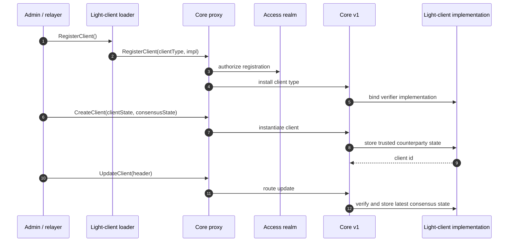
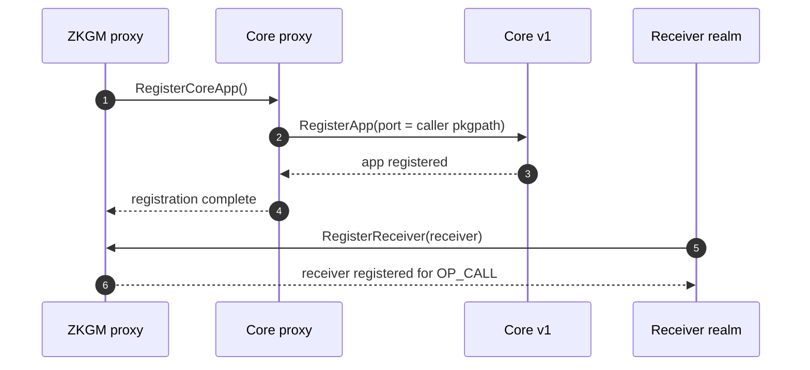
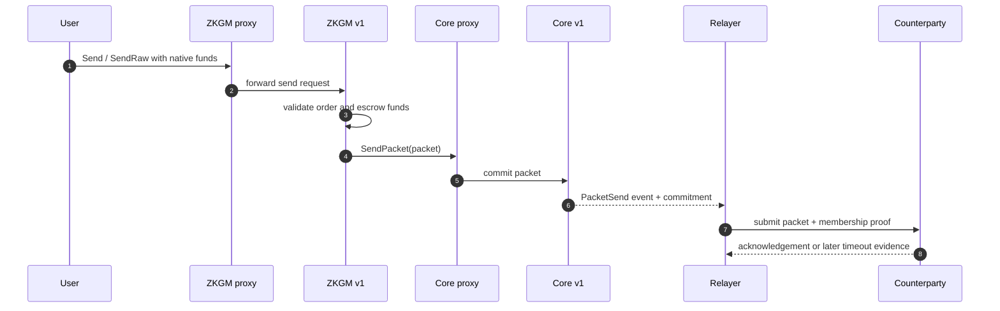
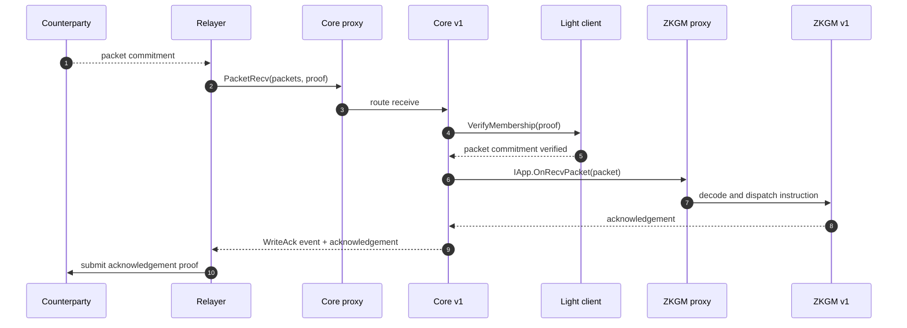

# Process Flows

This document summarizes the main runtime flows through the Gno IBC Union
realms. Each flow follows the same proxy → implementation → pure-package
layering described in the [architecture overview](README.md).

Throughout, a **relayer** is an off-chain process that watches both chains. It
reads committed packets or acknowledgements from one chain, builds the required
proof, and submits that proof to the other chain. The chains never talk
directly.

## Register a Light Client

Registering a light client is a local setup flow with two separate steps:

1. Install a light-client **type** through a loader realm such as `cometbls.RegisterClient`.
2. Create a light-client **instance** with `core.CreateClient`.
3. Keep the client fresh with later `core.UpdateClient` calls.

The loader realms, for example `cometbls.RegisterClient` ([lightclients/cometbls/register.gno](../../gno.land/r/onbloc/ibc/union/lightclients/cometbls/register.gno)) and `statelensics23mpt.RegisterClient` ([lightclients/statelensics23mpt/register.gno](../../gno.land/r/onbloc/ibc/union/lightclients/statelensics23mpt/register.gno)), call `core.RegisterClient` ([core/client.gno](../../gno.land/r/onbloc/ibc/union/core/client.gno)) with the implementation constructor for their client type. `core.CreateClient` then creates a concrete client id from the counterparty chain's initial client and consensus state. Later packet proofs are verified against that stored consensus state.

## Register an App

App registration is local wiring. It does not involve the relayer or the
counterparty chain.

1. The ZKGM proxy calls `RegisterCoreApp`.
2. Core binds the caller's package path as the app port.
3. Receiver realms register with ZKGM for `OP_CALL` dispatch.

`RegisterCoreApp` ([apps/ucs03_zkgm/register.gno](../../gno.land/r/onbloc/ibc/union/apps/ucs03_zkgm/register.gno)) crosses into `core.RegisterApp`. Core derives the port id from the caller's package path, so the app identity is its realm path. `core.RegisterAppForPort` remains the admin-only override for explicit port binding.

## Packet Send

A user sends local coin out to the counterparty chain.

1. The user calls `zkgm.Send` or `zkgm.SendRaw` as an EOA and attaches the coin.
2. ZKGM v1 validates the order and escrows the native coin in the proxy realm.
3. Core writes the packet commitment and emits `PacketSend`.
4. The relayer proves that packet to the counterparty chain.

`Send` / `SendRaw` ([apps/ucs03_zkgm/transfer.gno](../../gno.land/r/onbloc/ibc/union/apps/ucs03_zkgm/transfer.gno)) must be called as an EOA for native-token sends. `core.SendPacket` ([core/v1/packet.gno](../../gno.land/r/onbloc/ibc/union/core/v1/packet.gno)) checks the channel, writes the commitment, and emits the event the relayer watches. The escrowed coin stays locked in the proxy account until acknowledgement or timeout settlement.

## Packet Receive

Receiving is the inverse path: the relayer brings a counterparty packet and
proof into local core, and core dispatches the app callback.

1. The relayer calls `core.PacketRecv` with packets and proof.
2. Core verifies the proof through the channel's light client.
3. Core dispatches `IApp.OnRecvPacket` to the destination app.
4. ZKGM v1 executes the instruction and writes an acknowledgement through core.
5. The relayer proves that acknowledgement back to the counterparty.

`core.PacketRecv` ([core/core.gno](../../gno.land/r/onbloc/ibc/union/core/core.gno)) is relayer-gated through the access realm. Inactive clients are rejected before proof verification. For ZKGM, the v1 dispatcher routes instructions by opcode: Call, TokenOrder, Batch, or Forward. Forward packets may defer settlement through the async-ack path.
