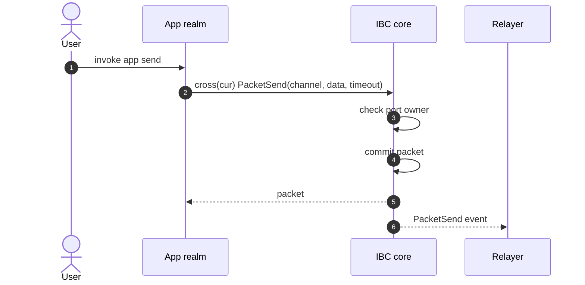
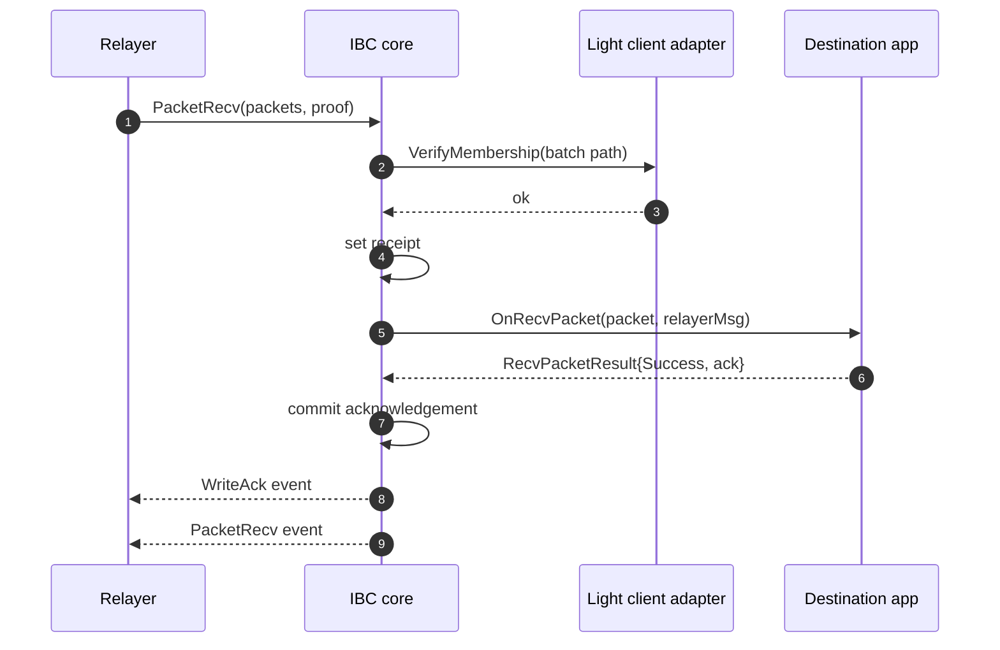
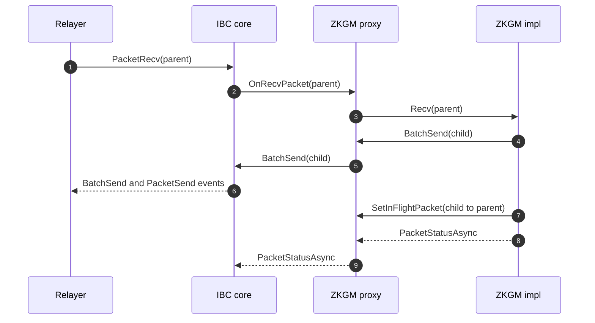
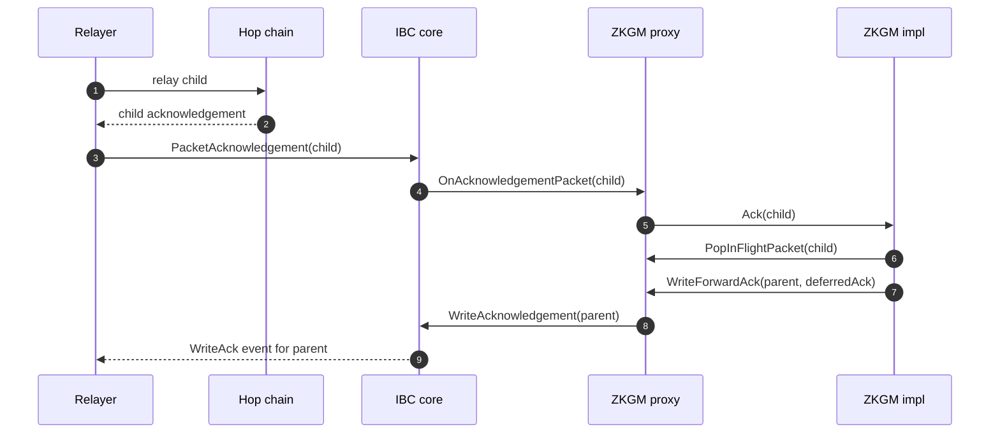

# IBC v1 Stack Architecture

This document explains how the IBC v1 core, light-client adapters, ZKGM app,
fixtures, events, and toolchain fit together in this repository. Start with
[IBC Overview](overview.md) if you want a primer on IBC concepts and vocabulary
before reading the architecture details.

It is written for contributors who need to understand the system boundaries
before changing implementation code. Detailed behavioral rules remain in the
focused specs:

- [IBC v1 Core](ibc-v1-core/README.md)
- [ZKGM v1 App](zkgm-v1/README.md)
- [Light Clients](light-clients.md)
- [Event Catalog](events.md)

## Realm Topology

The stack is split across core, light-client, and app realms. Gno realms are
addressed by module path, and the module path is the important identifier for
imports, port ownership, and cross-realm calls.

| Layer | Module path | Filesystem path | Role |
|-------|-------------|-----------------|------|
| Core | `gno.land/r/core/ibc/v1/core` | `gno.land/r/core/ibc/v1/core/` | Owns the IBC state machine, app registry, light-client registry, packet commitments, receipts, and acknowledgements. |
| CometBLS adapter | `gno.land/r/core/ibc/v1/lightclients/cometbls` | same | Realm wrapper that stores per-client state and delegates CometBLS verification to the package layer. |
| State-lens ICS23 MPT adapter | `gno.land/r/core/ibc/v1/lightclients/statelensics23mpt` | same | Verifies storage proofs against a referenced L1 client. |
| ZKGM proxy | `gno.land/r/gnoswap/ibc/v1/apps/zkgm` | `gno.land/r/core/ibc/v1/apps/zkgm/` | Registered IBC app realm and persistent ZKGM state owner. |
| ZKGM implementation | `gno.land/r/gnoswap/ibc/v1/apps/zkgm/v0/impl` | `gno.land/r/core/ibc/v1/apps/zkgm/v0/impl/` | Instruction dispatcher for call, token order, batch, and forward opcodes. |
| ZKGM loader | `gno.land/r/gnoswap/ibc/v1/apps/zkgm/v0/loader` | `gno.land/r/core/ibc/v1/apps/zkgm/v0/loader/` | Init-time glue that registers the proxy app and installs the active implementation. |

The ZKGM filesystem path uses `gno.land/r/core/...`, but the published module
paths use `gno.land/r/gnoswap/...`. Use module paths in code-facing
descriptions.

## External Actors

Relayers submit ordinary Gno transactions to IBC core entry points. They create
and update clients, run connection and channel handshakes, relay received
packets, relay acknowledgements, and submit timeouts. The market-maker path uses
`IntentPacketRecv`, which bypasses the normal proof flow by design.

Indexers consume emitted events. ZKGM activity is observed through IBC core
events such as `PacketSend`, `PacketRecv`, `WriteAck`, `PacketAck`, and
`PacketTimeout`. Event names, attributes, and encoding rules are cataloged in
[Event Catalog](events.md). Query patterns are documented in
[docs/tx-indexer.md](../tx-indexer.md).

End users and smoke harnesses submit ZKGM packets through `gnokey maketx call`.
Native-token `SendRaw` calls depend on the user call frame so the app can read
the attached send coins. A `maketx run` script changes the previous realm and
does not satisfy that requirement. Operational send flows are documented in
[ZKGM Packet Send Guide](../zkgm-packet-send-guide.md).

Counterparty chains determine which light client and fixture path is involved:

- Union to Gno uses the CometBLS adapter.
- Ethereum to Gno uses the state-lens ICS23 MPT adapter and Ethereum storage
  proof fixtures.

## Registration and Bootstrap

Core keeps registries for light clients and apps. Registration is normally
self-registration from the owning realm, with deployer-only paths for loaders
that install an implementation on behalf of another realm.

`RegisterClient` maps a client type to an `ILightClient` adapter. Known
production client types must be registered by their owning light-client realm.
Other client types must be scoped under the caller realm's package path.
`RegisterClientForType` is the deployer-only explicit registration path.

`RegisterApp` maps the caller realm's package path to an `IApp`. The
deployer-only `RegisterAppForPort` path can register an explicit port id. The
ZKGM loader uses that privileged path to register the proxy package path as the
app port and installs the current implementation pointer in the proxy.

Port identity is package-path based. Packet operations later check that the
calling realm's package path matches the port owner recorded during channel
opening.

The ordering from an empty core state to packet flow is:

1. Register light-client adapters and app ports.
2. Create the counterparty light client.
3. Update the client when a proof needs a newer consensus height.
4. Open a connection.
5. Open a channel on the registered app port.
6. Send, receive, acknowledge, or time out packets.

Protocol relay entry points are open unless a section states otherwise.
Registration is ownership-scoped, with deployer-only explicit registration
paths. `ForceUpdateClient` is also deployer-only. Normal safety comes from
registration ownership checks, duplicate-registration checks, adapter proof
verification, state-machine transitions, and package-path based packet
authority.

Key bootstrap invariants:

- Numeric client, connection, and channel ids are monotonic and start at `1`.
  The zero value is an unset sentinel, not a live identifier.
- `HasClient` and `HasApp` are safe probes for setup realms that need to check
  whether registration already happened.
- Counterparty proofs verify against consensus state stored for
  `msg.ProofHeight`. Relayers must update the client before submitting proofs
  for heights that the local client has not learned.
- The app realm is the channel owner. User-facing app sends call
  `core.PacketSend(cross(cur), ...)` from the owning app realm.
- Proven receive replay is handled by packet receipts. Async ack writes require
  an existing receipt. Ack and timeout replay is bounded by the source packet
  commitment.

## State Ownership

IBC core owns protocol state in one package-level state object. The major stores
are:

| Store | Key | Value |
|-------|-----|-------|
| Light-client registry | `ClientType` | `ILightClient` |
| Client type map | `ClientId` | `ClientType` |
| Client state | `ClientId` | encoded client state bytes |
| Consensus state | `ClientId`, `Height` | encoded consensus state bytes |
| Connections | `ConnectionId` | connection state |
| Channels | `ChannelId` | channel state |
| Ports | port path string | `IApp` |
| Channel owners | `ChannelId` | port id bytes |
| Packet commitments | packet or batch hash | commitment sentinel |
| Packet receipts and acks | packet or batch hash | receipt sentinel or acknowledgement hash |

<!--
TODO(#43): once `chain/params` exposes a reader (e.g. `params.GetBytes`),
the "Packet commitments" and "Packet receipts and acks" rows in the table
above lose their in-memory mirror. After that, those entries live only in
the `params` store and the paragraph below should note that they are read
back from `params` rather than from in-memory maps.
-->

Core also commits selected state into chain `params` with derived path keys.
Counterparty light clients verify those committed values rather than the
in-memory maps directly. Path derivation is described in [Store and Paths](ibc-v1-core/store-and-paths.md).

Light-client adapters own their decoded per-client state. Core stores committed
bytes and delegates client-specific interpretation to the adapter.

The ZKGM proxy owns all persistent app state:

- active implementation pointer and allowed implementation list
- admin and pause state
- receiver registry
- token origins and metadata images
- channel balances
- in-flight forward packet table
- token bucket rate-limit state

The ZKGM implementation realm is mostly dispatcher logic. It calls back into the
proxy for persistent reads and writes.

## Authorization Boundaries

The stack relies on call-frame identity instead of a single global permission
model.

Core registration and packet operations use call-frame identity. `RegisterApp`
and ordinary `RegisterClient` bind implementations to the caller realm's
authorized namespace. `PacketSend`, `BatchSend`, and `WriteAcknowledgement`
check `cur.Previous().PkgPath()` against the channel's registered port owner.
Privileged explicit registration paths and `ForceUpdateClient` require the
core deployer and an origin call.

Light-client adapters use a core-only guard for mutating methods. Core is the
only realm expected to create clients, update clients, force-update clients, or
record misbehaviour through the adapter.

The ZKGM proxy uses implementation allow-list checks for ledger writes and
implementation callbacks. Admin operations additionally require origin-call
authentication.

Native-token ZKGM sends require a direct user call. This keeps
`OriginSend()` aligned with the coins that actually landed in the ZKGM realm.

## Packet Lifecycle

### Send

`PacketSend` verifies the caller owns the source port, checks that the channel
and connection are open, commits the packet, and emits `PacketSend`.

`BatchSend` commits a same-channel packet batch, emits one `BatchSend` event,
and emits one `PacketSend` event per child packet.

### Receive With Synchronous Ack

`PacketRecv` verifies membership for the packet batch, rejects timed-out
packets, sets receipts, dispatches app receive callbacks, and writes an
acknowledgement immediately when the app returns a synchronous success or
failure status.

### Receive With Async Forward Ack

In this sequence, `Hop` is the chain that receives the forwarded child packet.

Phase 1, parent recv puts the forwarded packet in flight:

Forward execution sends a child packet immediately, stores the parent packet in
the proxy's in-flight table, and returns `PacketStatusAsync`.

Phase 2, child resolution writes the parent acknowledgement:

Later child ack or timeout handling resolves the parent by calling core `WriteAcknowledgement`.

### Intent Receive

`IntentPacketRecv` is the market-maker receive path. It does not verify packet
membership proof, does not write a packet receipt, and does not automatically
write an acknowledgement. It invokes the app intent callback and emits
`IntentPacketRecv`.

### Acknowledgement and Timeout

`PacketAcknowledgement` verifies acknowledgement membership, invokes the source
app acknowledgement callback, deletes source packet commitments, and emits
`PacketAck`.

`PacketTimeout` verifies receipt non-membership after timeout, invokes the
source app timeout callback, deletes the source packet commitment, and emits
`PacketTimeout`.

## Handshake Lifecycle

Client creation and update are delegated to registered light-client adapters.

Connections and channels use four-step handshakes:

- init
- try
- ack
- confirm

Try, ack, and confirm steps verify the expected counterparty state through the
connection's client. Channel steps also invoke app callbacks. Channel owner
state is recorded at channel init or try so later packet authorization can use
the source port owner.

The focused core spec maps each proof-bearing handshake and packet entry point
to its verified path, verified value, and local mutation. See
[Connection and Channel Lifecycle](ibc-v1-core/connection-channel-lifecycle.md) for that matrix.

Channel close entry points exist but currently panic as unsupported. Close
events are defined but not emitted. See [Surface and Deltas](ibc-v1-core/surface-and-deltas.md) for the
core behavior and [Event Catalog](events.md) for the event surface.

## Light-Client Adapter Contract

Core calls adapters through `core.ILightClient`. The canonical interface is
documented in [Light Clients](light-clients.md#adapter-contract). Some adapters
also implement `IForceLightClient` for deployer-only recovery updates.

Adapter proof verification must reject inactive clients before decoding proof
bytes. CometBLS determines frozen and expired status from its own client state.
State-lens mirrors the referenced L1 client status and verifies L2 consensus
state membership through that L1 client.

## ZKGM Proxy and Implementation Pattern

ZKGM splits persistent state from instruction logic. The proxy is registered as
the IBC app. The active implementation pointer can be updated without changing
the registered app port.

The implementation exposes a `Send` entry point plus four IBC callbacks:

- `Send`
- `Recv`
- `IntentRecv`
- `Ack`
- `Timeout`

Those entry points route through dispatcher helpers for the four supported
opcode families:

- `OP_FORWARD`
- `OP_CALL`
- `OP_BATCH`
- `OP_TOKEN_ORDER`

`OP_CALL` invokes a registered receiver. `OP_TOKEN_ORDER` handles rate-limited
native and voucher accounting. `OP_BATCH` executes call and token-order
children. `OP_FORWARD` sends a child packet and defers the parent
acknowledgement.

## Cross-Chain Topology

Two cross-chain proof directions are represented in the current tree:

- Union <-> Gno through the CometBLS client path.
- Ethereum -> Gno through the state-lens ICS23 MPT client path.

ZKGM packet bytes are Solidity ABI compatible and use the params tuple form
described in [ZKGM v1 App](zkgm-v1/README.md).

## Toolchain Boundary

The repository pins an upstream Gno version and links a temporary local stdlib
overlay into the cached Gno tree. The overlay provides native bindings needed by
the current light-client and ZKGM code. It is expected to disappear once those
packages and native registrations land upstream in Gno. The migration is
tracked in [onbloc/gno-ibc#74](https://github.com/onbloc/gno-ibc/issues/74).

See [docs/README.md](../README.md#local-development) for the setup path and
Make targets.

## Out of Scope

This architecture spec intentionally does not cover:

- future-state proposals
- proof generation internals outside this repository
- channel close lifecycle beyond the current unsupported stubs
- local planning notes that are not part of committed documentation
