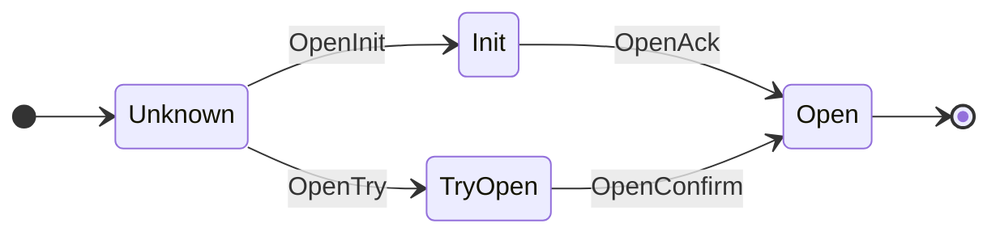
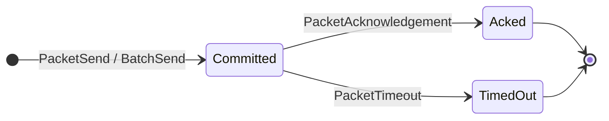
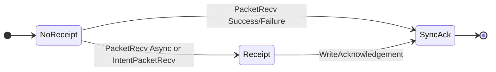

# IBC v1 Core Spec

This document describes the current IBC v1 core realm implementation under
[gno.land/r/core/ibc/v1/core](../../gno.land/r/core/ibc/v1/core).

## Scope

The core realm owns the IBC state machine for:

- light-client registration and client lifecycle
- connection and channel handshakes
- packet commitments, receipts, acknowledgements, and timeouts
- application registration and callback dispatch
- events emitted for relayers and indexers

The implementation is a Gno realm. Entry points that mutate core state take
`cur realm` and are invoked from other realms with `cross(cur)`.

## Module Layout

The core realm is published as `gno.land/r/core/ibc/v1/core` and its module path
matches the filesystem path.

| File | Purpose |
|------|---------|
| `core.gno` | State construction, interface definitions, app registration, commitment helpers, and render output |
| `types.gno` | Domain types, enums, string rendering, and ABI encoding helpers |
| `msg.gno` | Message structs for public entry points |
| `path.gno` | Commitment namespace constants, path derivation, and sentinel values |
| `commit.gno` | Packet, packet batch, and acknowledgement hashing |
| `state.gno` | Core state stores, save helpers, query helpers, and error sentinels |
| `client.gno` | Client lifecycle, client registration, and client queries |
| `connection.gno` | Connection handshake and connection query |
| `channel.gno` | Channel handshake, channel close stubs, channel query, and channel getter |
| `packet.gno` | Packet send, receive, acknowledgement, timeout, batch, and query entry points |
| `events.gno` | Event constants and emitter helpers |

## Registered Interfaces

Light clients are registered by client type through `RegisterClient`. The core
stores the adapter instance and delegates create, update, status, membership,
and non-membership verification to that adapter.

Applications are registered by port path through `RegisterApp`. Channel and
packet entry points use the previous realm package path as the application
identity, so app realms must call core entry points directly rather than through
unregistered helper realms.

The core-facing light-client interface contains create, update, membership
verification, non-membership verification, timestamp, latest-height, and status
methods. `IForceLightClient` is an optional extension used only by
`ForceUpdateClient`.

The app interface contains channel-open callbacks, packet receive callbacks,
intent receive callbacks, acknowledgement callbacks, and timeout callbacks.
`Send` is not part of the core app callback interface. Apps call core send entry
points directly.

`RegisterClient`, `RegisterApp`, `CreateClient`, `UpdateClient`, connection
handshake entry points, and channel handshake entry points are not admin-gated.
They are open protocol entry points whose safety comes from adapter
registration, proof verification, and state-machine checks.

## App Interface

IBC applications register an implementation of `IApp` at their port id. Locally
owned ports normally use the app realm package path bytes as the port id.

```go
type IApp interface {
    OnChannelOpenInit(cur realm, connectionId ConnectionId, channelId ChannelId, version string, relayer address)
    OnChannelOpenTry(cur realm, connectionId ConnectionId, channelId ChannelId, version string, counterpartyVersion string, relayer address)
    OnChannelOpenAck(cur realm, channelId ChannelId, counterpartyChannelId ChannelId, counterpartyVersion string, relayer address)
    OnChannelOpenConfirm(cur realm, channelId ChannelId, relayer address)
    OnChannelCloseInit(cur realm, channelId ChannelId, relayer address)
    OnChannelCloseConfirm(cur realm, channelId ChannelId, relayer address)
    OnRecvPacket(cur realm, packet Packet, relayer address, relayerMsg []byte) RecvPacketResult
    OnIntentRecvPacket(cur realm, packet Packet, marketMaker address, marketMakerMsg []byte)
    OnAcknowledgementPacket(cur realm, packet Packet, acknowledgement []byte, relayer address)
    OnTimeoutPacket(cur realm, packet Packet, relayer address)
}
```

All callbacks take `cur realm` as the first argument. Core invokes application
callbacks with `cross(cur)`, so the callback runs in the application realm and
can mutate application state.

An app type must satisfy the `core.IApp` interface before it can be registered
with `RegisterApp`.

Callback dispatch uses the port id registered through `RegisterApp`. Missing
app registrations panic with `ErrPortNotFound`. For channel-owned packet paths,
core first resolves the channel owner and then looks up the app by that port id.

| Callback | Core entry point | Core has already done | Core does after |
|----------|------------------|-----------------------|-----------------|
| `OnChannelOpenInit` | `ChannelOpenInit` | Allocated `channelId` and recorded the channel owner. | Saves the channel in `Init` state and emits `ChannelOpenInit`. |
| `OnChannelOpenTry` | `ChannelOpenTry` | Verified the counterparty `Init` proof, allocated `channelId`, and recorded the channel owner. | Saves the channel in `TryOpen` state and emits `ChannelOpenTry`. |
| `OnChannelOpenAck` | `ChannelOpenAck` | Verified the counterparty `TryOpen` proof. | Transitions the channel to `Open`, stores the counterparty channel id and version, and emits `ChannelOpenAck`. |
| `OnChannelOpenConfirm` | `ChannelOpenConfirm` | Verified the counterparty `Open` proof. | Transitions the channel to `Open` and emits `ChannelOpenConfirm`. |
| `OnChannelCloseInit` | `ChannelCloseInit` | Nothing. The entry point panics immediately. | Unreachable. |
| `OnChannelCloseConfirm` | `ChannelCloseConfirm` | Nothing. The entry point panics immediately. | Unreachable. |
| `OnRecvPacket` | `PacketRecv` | Verified the packet batch membership proof, checked the channel, timeout, and replay receipt. | Handles `RecvPacketResult`, commits sync acks when needed, and emits `PacketRecv`. |
| `OnIntentRecvPacket` | `IntentPacketRecv` | Checked the channel, timeout, and replay receipt. | Emits `IntentPacketRecv`. |
| `OnAcknowledgementPacket` | `PacketAcknowledgement` | Verified acknowledgement membership and found an outstanding source commitment. | Deletes the source packet commitment and emits `PacketAck`. |
| `OnTimeoutPacket` | `PacketTimeout` | Verified timeout eligibility and receipt non-membership. | Deletes the source packet commitment and emits `PacketTimeout`. |

If a callback panics, the transaction aborts and core does not keep partial
state changes from that entry point.

`OnRecvPacket` returns a `RecvPacketResult`:

```go
type PacketStatus uint8

const (
    PacketStatusUnknown PacketStatus = 0
    PacketStatusSuccess PacketStatus = 1
    PacketStatusFailure PacketStatus = 2
    PacketStatusAsync   PacketStatus = 3
)

type RecvPacketResult struct {
    Status PacketStatus
    Ack    []byte
}
```

| Status | Ack requirement | Core action |
|--------|-----------------|-------------|
| `PacketStatusAsync` | Ignored. | Records a receipt without committing the final acknowledgement. |
| `PacketStatusSuccess` | Non-empty. | Commits the ack and emits `WriteAck` in the receive transaction. |
| `PacketStatusFailure` | Non-empty. | Commits the ack and emits `WriteAck` in the receive transaction. |
| `PacketStatusUnknown` | Any value. | Panics with `ErrUnknownPacketStatus`. |

`PacketStatusSuccess` and `PacketStatusFailure` with an empty `Ack` panic with
`ErrSyncAckEmpty`. Apps that need delayed acknowledgement semantics must return
`PacketStatusAsync` and later commit an acknowledgement through
`WriteAcknowledgement` or `BatchAcks`.

Apps in other realms should construct results with
`core.NewRecvPacketResult(cross(cur), status, ack)` instead of allocating
`RecvPacketResult` directly. This keeps the result construction inside the core
realm crossing frame.

`WriteAcknowledgement` and `BatchAcks` are the async ack writers. Both require
the caller realm to match the destination channel owner. `WriteAcknowledgement`
also rejects empty acknowledgements and already-written acknowledgements.

`IntentPacketRecv` is asymmetric with normal receive. It does not verify a
source-chain membership proof, does not return `RecvPacketResult`, and does not
write an acknowledgement by itself. Its event uses `market_maker_msg` where
normal receive uses `maker_msg`.

Channel close callbacks are declared only to satisfy the interface. The current
`ChannelCloseInit` and `ChannelCloseConfirm` entry points panic before callback
dispatch, and no code writes `ChannelStateClosed`.

## Domain Types

Core uses small wrapper types for protocol identifiers and wire values:

| Type | Underlying type | Notes |
|------|-----------------|-------|
| `ClientId` | `uint32` | Allocated by core. Starts at `1`. |
| `ConnectionId` | `uint32` | Allocated by core. Starts at `1`. |
| `ChannelId` | `uint32` | Allocated by core. Starts at `1`. |
| `ClientType` | `string` | Light-client registry key. |
| `Timestamp` | `uint64` | Unix time in nanoseconds. |
| `Height` | `uint64` | Chain height. |
| `Bytes` | `[]byte` | Used for port ids and byte-rendered fields. |
| `H256` | `[32]byte` | Keccak hash output and commitment value. |

Defined enums are:

| Enum | Values |
|------|--------|
| `Status` | `StatusUnknown`, `StatusActive`, `StatusExpired`, `StatusFrozen` |
| `ConnectionState` | `ConnectionStateUnknown`, `ConnectionStateInit`, `ConnectionStateTryOpen`, `ConnectionStateOpen` |
| `ChannelState` | `ChannelStateUnknown`, `ChannelStateInit`, `ChannelStateTryOpen`, `ChannelStateOpen`, `ChannelStateClosed` |
| `PacketStatus` | `PacketStatusUnknown`, `PacketStatusSuccess`, `PacketStatusFailure`, `PacketStatusAsync` |

`ChannelStateClosed` is defined for compatibility but unreachable in current
execution because channel close entry points panic before mutating state.

Packets contain source channel, destination channel, data, timeout height, and
timeout timestamp. Packet identity is the Keccak hash of the ABI-encoded packet,
not a sequence number. There is no `Sequence` field.

`Packet.TimeoutHeight` exists for ABI shape compatibility, but it must be zero.
Packet encoding panics if a non-zero timeout height is provided. Current timeout
logic uses `TimeoutTimestamp`.

## ABI Encoding

Core ABI encoding uses `gno.land/p/core/encoding/abi` and the same params-style
encoding flavor used by ZKGM wire bytes.

| Type | Encoded tuple |
|------|---------------|
| `Connection` | `uint8 state`, `uint32 clientId`, `uint32 counterpartyClientId`, `uint32 counterpartyConnectionId` |
| `Channel` | `uint8 state`, `uint32 connectionId`, `uint32 counterpartyChannelId`, `bytes counterpartyPortId`, `string version` |
| `Packet` | `uint32 sourceChannelId`, `uint32 destinationChannelId`, `bytes data`, `uint64 timeoutHeight`, `uint64 timeoutTimestamp` |

Packet commitments are derived as:

- `CommitPacket(packet) = CommitPackets([]Packet{packet})`
- `CommitPackets(packets) = keccak(encodeTopLevelDynamic(encodePacketArray(packets)))`
- `CommitAcks(acks) = mergeAck(keccak(encodeTopLevelDynamic(encodeBytesArray(acks))))`

`mergeAck` overwrites the first byte of the acknowledgement hash with the first
byte, `0x01`, of `COMMITMENT_MAGIC`. This allows the receipt store to
distinguish a bare receipt sentinel from a committed acknowledgement hash.

## Store Layout and Commitments

Core keeps two views of committed state:

- in-memory maps inside the package-level `State` struct, used by core logic
- chain `params` commitments, used by counterparty light clients

Every `params` commitment key is a hex-encoded 32-byte path, and every
commitment value is 32 bytes. The `commit` helper writes those values through
`params.SetBytes`.

Major in-memory stores:

| Store | Key | Value |
|-------|-----|-------|
| `clientRegistry` | `ClientType` | light-client adapter |
| `clientTypes` | `ClientId` | `ClientType` |
| `clientStates` | `ClientId` | encoded client state bytes |
| `consensusStates` | `ClientId`, `Height` | encoded consensus state bytes |
| `connections` | `ConnectionId` | `Connection` |
| `channels` | `ChannelId` | `Channel` |
| `ports` | port id string | app implementation |
| `channelOwners` | `ChannelId` | port id bytes |
| `batchPackets` | derived packet or batch path | `H256` commitment value |
| `batchReceipts` | derived receipt or ack path | `H256` receipt sentinel or ack hash |

Path namespaces:

| Namespace | Last byte | Used by |
|-----------|-----------|---------|
| `CLIENT_STATE` | `0x00` | `ClientStatePath` |
| `CONSENSUS_STATE` | `0x01` | `ConsensusStatePath` |
| `CONNECTIONS` | `0x02` | `ConnectionPath` |
| `CHANNELS` | `0x03` | `ChannelPath` |
| `PACKETS` | `0x04` | `BatchPacketsPath`, `PacketCommitmentPath` |
| `PACKET_ACKS` | `0x05` | `BatchReceiptsPath`, `PacketAcknowledgementPath` |

Path helpers use Keccak over the namespace plus right-aligned 32-byte
big-endian numeric ids or hashes. For example,
`ConsensusStatePath(clientId, height)` hashes the consensus-state namespace,
`clientId`, and `height`.

Sentinel values:

| Sentinel | Meaning |
|----------|---------|
| `COMMITMENT_MAGIC` | Pending outgoing packet or batch commitment |
| `COMMITMENT_MAGIC_ACK` | Bare receipt with no application acknowledgement |

Missing receipt state means no receipt. `COMMITMENT_MAGIC_ACK` means a packet
was received but no acknowledgement hash has been committed. Any value other
than `COMMITMENT_MAGIC_ACK` in the receipt store is treated as an
acknowledgement hash.

Committed acknowledgement values are not sentinels. They are
`CommitAcks(...)` hashes. `CommitAcks(...)` uses `mergeAck`, so committed
acknowledgement hashes start with the same first byte as `COMMITMENT_MAGIC`.

## Client Lifecycle

`CreateClient` allocates a client identifier for the requested client type,
delegates initialization to the registered light-client adapter, stores the
client state and initial consensus state, and emits `CreateClient`.

Example emission:

```json
{
  "type": "CreateClient",
  "attrs": [
    {
      "key": "client_id",
      "value": "1"
    },
    {
      "key": "client_type",
      "value": "cometbls"
    }
  ],
  "pkg_path": "gno.land/r/core/ibc/v1/core"
}
```

`UpdateClient` loads the registered adapter, delegates header verification and
state transition, persists the returned client state and consensus state, and
emits `UpdateClient`.

Example emission:

```json
{
  "type": "UpdateClient",
  "attrs": [
    {
      "key": "client_type",
      "value": "cometbls"
    },
    {
      "key": "client_id",
      "value": "1"
    },
    {
      "key": "height",
      "value": "123"
    }
  ],
  "pkg_path": "gno.land/r/core/ibc/v1/core"
}
```

`ForceUpdateClient` is a deployer-only operational path. It requires an origin
call, requires the target adapter to support the force-update interface, and
then persists the adapter-provided state update. It emits the same
`UpdateClient` event shape as a normal client update.

Status-sensitive proof verification is delegated to registered light-client
adapters. V1 adapters must reject inactive clients before membership or
non-membership proof decoding.

## Connection and Channel Lifecycle

Each proof-bearing handshake and packet entry point verifies a path and value
against the registered counterparty client at `msg.ProofHeight`.

| Entry point | Proof type | Verified path | Verified value | Local mutation after proof |
|-------------|------------|---------------|----------------|----------------------------|
| `ConnectionOpenInit` | none | n/a | n/a | Allocates `connectionId`, saves `Connection{Init, ClientId, CounterpartyClientId, 0}`, and emits. |
| `ConnectionOpenTry` | membership | `ConnectionPath(msg.CounterpartyConnectionId)` | `keccak(Connection{Init, msg.CounterpartyClientId, msg.ClientId, 0}.EthAbiEncode())` | Allocates `connectionId`, saves `Connection{TryOpen, ...}`, and emits. |
| `ConnectionOpenAck` | membership | `ConnectionPath(msg.CounterpartyConnectionId)` | `keccak(Connection{TryOpen, connection.CounterpartyClientId, connection.ClientId, msg.ConnectionId}.EthAbiEncode())` | Transitions to `Open`, stores the counterparty connection id, and emits. |
| `ConnectionOpenConfirm` | membership | `ConnectionPath(connection.CounterpartyConnectionId)` | `keccak(Connection{Open, connection.CounterpartyClientId, connection.ClientId, msg.ConnectionId}.EthAbiEncode())` | Transitions to `Open` and emits. |
| `ChannelOpenInit` | none | n/a | n/a | Allocates `channelId`, records the port owner, calls `OnChannelOpenInit`, saves `Channel{Init, ...}`, and emits. |
| `ChannelOpenTry` | membership | `ChannelPath(msg.Channel.CounterpartyChannelId)` | `keccak(Channel{Init, connection.CounterpartyConnectionId, 0, msg.PortId, msg.CounterpartyVersion}.EthAbiEncode())` | Allocates `channelId`, records the port owner, calls `OnChannelOpenTry`, saves `Channel{TryOpen, ...}`, and emits. |
| `ChannelOpenAck` | membership | `ChannelPath(msg.CounterpartyChannelId)` | `keccak(Channel{TryOpen, connection.CounterpartyConnectionId, msg.ChannelId, portId, msg.CounterpartyVersion}.EthAbiEncode())` | Calls `OnChannelOpenAck`, transitions to `Open`, stores the counterparty channel id and version, and emits. |
| `ChannelOpenConfirm` | membership | `ChannelPath(channel.CounterpartyChannelId)` | `keccak(Channel{Open, connection.CounterpartyConnectionId, msg.ChannelId, portId, channel.Version}.EthAbiEncode())` | Calls `OnChannelOpenConfirm`, transitions to `Open`, and emits. |
| `PacketRecv` | membership | `BatchPacketsPath(CommitPackets(msg.Packets))` | `COMMITMENT_MAGIC` | Per packet, writes a receipt, calls `OnRecvPacket`, optionally commits a sync ack, and emits. |
| `PacketAcknowledgement` | membership | `BatchReceiptsPath(CommitPackets(msg.Packets))` | `CommitAcks(msg.Acknowledgements)` | Per packet, calls `OnAcknowledgementPacket`, deletes the source commitment, and emits. |
| `PacketTimeout` | non-membership | `BatchReceiptsPath(CommitPacket(msg.Packet))` | n/a | Calls `OnTimeoutPacket`, deletes the source commitment, and emits. |

For connection and channel handshakes, the verified value is the counterparty's
expected committed state from the opposite perspective. Core reconstructs that
counterparty state from the local record, relayer-supplied message fields, and
the next expected handshake state, ABI-encodes it, hashes it, and verifies the
hash at the counterparty path.

In the table, `connection` and `channel` refer to locally stored records loaded
during the entry point. `portId` is the channel owner resolved from the local
channel owner store.

For packet flows, the verified value is a commitment sentinel or acknowledgement
hash rather than an encoded connection or channel record. `PacketRecv` proves
the source committed the packet batch. `PacketAcknowledgement` proves the
destination committed the ack batch. `PacketTimeout` proves the destination
receipt path is absent.

Connections follow the standard four-step handshake:

- `ConnectionOpenInit`
- `ConnectionOpenTry`
- `ConnectionOpenAck`
- `ConnectionOpenConfirm`

`ConnectionOpenInit` emits before a counterparty connection id is known:

Example emission:

```json
{
  "type": "ConnectionOpenInit",
  "attrs": [
    {
      "key": "connection_id",
      "value": "1"
    },
    {
      "key": "client_id",
      "value": "1"
    },
    {
      "key": "counterparty_client_id",
      "value": "7"
    }
  ],
  "pkg_path": "gno.land/r/core/ibc/v1/core"
}
```

`ConnectionOpenTry` includes the counterparty connection id. `ConnectionOpenAck`
and `ConnectionOpenConfirm` share this four-attribute shape:

Example emission:

```json
{
  "type": "ConnectionOpenTry",
  "attrs": [
    {
      "key": "connection_id",
      "value": "1"
    },
    {
      "key": "client_id",
      "value": "1"
    },
    {
      "key": "counterparty_client_id",
      "value": "7"
    },
    {
      "key": "counterparty_connection_id",
      "value": "3"
    }
  ],
  "pkg_path": "gno.land/r/core/ibc/v1/core"
}
```

Channels follow the same handshake shape:

- `ChannelOpenInit`
- `ChannelOpenTry`
- `ChannelOpenAck`
- `ChannelOpenConfirm`

`ChannelOpenInit` records the calling app realm as the source port owner. The
counterparty channel identifier is only known after later handshake steps, so
the init event does not imply a final counterparty channel mapping.

Example emission:

```json
{
  "type": "ChannelOpenInit",
  "attrs": [
    {
      "key": "port_id",
      "value": "0x676e6f2e6c616e642f722f676e6f737761702f6962632f76312f617070732f7a6b676d"
    },
    {
      "key": "channel_id",
      "value": "1"
    },
    {
      "key": "counterparty_port_id",
      "value": "0x77617374312e2e2e"
    },
    {
      "key": "connection_id",
      "value": "1"
    },
    {
      "key": "connection_client_id",
      "value": "1"
    },
    {
      "key": "connection_counterparty_client_id",
      "value": "7"
    },
    {
      "key": "connection_counterparty_connection_id",
      "value": "3"
    },
    {
      "key": "version",
      "value": "ucs03-zkgm-0"
    }
  ],
  "pkg_path": "gno.land/r/core/ibc/v1/core"
}
```

The `port_id` value above decodes to
`gno.land/r/gnoswap/ibc/v1/apps/zkgm`, the proxy realm pkgpath used by ZKGM.
Other apps emit their own pkgpath bytes.

`ChannelOpenTry`, `ChannelOpenAck`, and `ChannelOpenConfirm` all include
`counterparty_channel_id` and share this nine-attribute shape:

Example emission:

```json
{
  "type": "ChannelOpenAck",
  "attrs": [
    {
      "key": "port_id",
      "value": "0x676e6f2e6c616e642f722f676e6f737761702f6962632f76312f617070732f7a6b676d"
    },
    {
      "key": "channel_id",
      "value": "1"
    },
    {
      "key": "counterparty_port_id",
      "value": "0x77617374312e2e2e"
    },
    {
      "key": "counterparty_channel_id",
      "value": "27"
    },
    {
      "key": "connection_id",
      "value": "1"
    },
    {
      "key": "connection_client_id",
      "value": "1"
    },
    {
      "key": "connection_counterparty_client_id",
      "value": "7"
    },
    {
      "key": "connection_counterparty_connection_id",
      "value": "3"
    },
    {
      "key": "version",
      "value": "ucs03-zkgm-0"
    }
  ],
  "pkg_path": "gno.land/r/core/ibc/v1/core"
}
```

Channel close entry points are present but unsupported. `ChannelCloseInit` and
`ChannelCloseConfirm` currently panic instead of transitioning channel state or
emitting close events.



## Packet Lifecycle

`PacketSend` validates that the caller owns the source port, verifies that the
channel is open, commits the packet, and emits `PacketSend`.

Example emission:

```json
{
  "type": "PacketSend",
  "attrs": [
    {
      "key": "packet_hash",
      "value": "0x0000...000000"
    },
    {
      "key": "packet_data",
      "value": "0x0801..."
    },
    {
      "key": "source_channel_id",
      "value": "1"
    },
    {
      "key": "source_channel_version",
      "value": "ucs03-zkgm-0"
    },
    {
      "key": "source_connection_id",
      "value": "1"
    },
    {
      "key": "source_connection_client_id",
      "value": "1"
    },
    {
      "key": "destination_channel_id",
      "value": "27"
    },
    {
      "key": "destination_connection_id",
      "value": "3"
    },
    {
      "key": "destination_connection_client_id",
      "value": "7"
    },
    {
      "key": "timeout_timestamp",
      "value": "1750000000000000000"
    }
  ],
  "pkg_path": "gno.land/r/core/ibc/v1/core"
}
```

`BatchSend` validates a same-channel packet batch, commits all packet
commitments, emits `BatchSend`, and emits a per-packet `PacketSend` event.

Example emission:

```json
{
  "type": "BatchSend",
  "attrs": [
    {
      "key": "batch_hash",
      "value": "0x0000...000000"
    },
    {
      "key": "source_channel_id",
      "value": "1"
    },
    {
      "key": "source_channel_version",
      "value": "ucs03-zkgm-0"
    },
    {
      "key": "source_connection_id",
      "value": "1"
    },
    {
      "key": "source_connection_client_id",
      "value": "1"
    },
    {
      "key": "destination_channel_id",
      "value": "27"
    },
    {
      "key": "destination_connection_id",
      "value": "3"
    },
    {
      "key": "destination_connection_client_id",
      "value": "7"
    }
  ],
  "pkg_path": "gno.land/r/core/ibc/v1/core"
}
```

The batch event does not include `packet_hash`, `packet_data`, or
`timeout_timestamp`. Each child packet still emits its own `PacketSend` event
after the batch event.

`BatchAcks` commits multiple async acknowledgements for packets on the same
destination channel. It uses the same destination app ownership check as
`WriteAcknowledgement`.

`BatchAcks` writes only the aggregate batch entry under
`BatchReceiptsPath(batchHash)`. It does not update per-packet receipt entries,
so `HasAcknowledgement(_, packet)` for individual packets in the batch returns
false. No event is emitted. Consumers must observe the bulk commit by querying
batch receipt state directly.

`PacketRecv` verifies the packet batch proof against the destination channel's
client, rejects timed-out packets, skips packets that already have receipts,
dispatches `OnRecvPacket` to the destination app, and handles the returned
status:

- synchronous statuses write an acknowledgement immediately
- `PacketStatusAsync` records receipt state without writing the final
  acknowledgement

Example emission:

```json
{
  "type": "PacketRecv",
  "attrs": [
    {
      "key": "packet_hash",
      "value": "0x0000...000000"
    },
    {
      "key": "packet_data",
      "value": "0x0801..."
    },
    {
      "key": "source_channel_id",
      "value": "27"
    },
    {
      "key": "source_connection_id",
      "value": "3"
    },
    {
      "key": "source_connection_client_id",
      "value": "7"
    },
    {
      "key": "destination_channel_id",
      "value": "1"
    },
    {
      "key": "destination_channel_version",
      "value": "ucs03-zkgm-0"
    },
    {
      "key": "destination_connection_id",
      "value": "1"
    },
    {
      "key": "destination_connection_client_id",
      "value": "1"
    },
    {
      "key": "timeout_timestamp",
      "value": "1750000000000000000"
    },
    {
      "key": "maker_msg",
      "value": "0x"
    }
  ],
  "pkg_path": "gno.land/r/core/ibc/v1/core"
}
```

`IntentPacketRecv` uses the same receive-side shape, but the final attribute key
is `market_maker_msg` instead of `maker_msg`.

`IntentPacketRecv` is the market-maker receive path. It dispatches packet
handling without the normal proof and acknowledgement write flow.

`WriteAcknowledgement` is the async acknowledgement writer. Only the destination
app owner for the channel can write the acknowledgement.

Example emission:

```json
{
  "type": "WriteAck",
  "attrs": [
    {
      "key": "packet_hash",
      "value": "0x0000...000000"
    },
    {
      "key": "packet_data",
      "value": "0x0801..."
    },
    {
      "key": "source_channel_id",
      "value": "27"
    },
    {
      "key": "source_connection_id",
      "value": "3"
    },
    {
      "key": "source_connection_client_id",
      "value": "7"
    },
    {
      "key": "destination_channel_id",
      "value": "1"
    },
    {
      "key": "destination_channel_version",
      "value": "ucs03-zkgm-0"
    },
    {
      "key": "destination_connection_id",
      "value": "1"
    },
    {
      "key": "destination_connection_client_id",
      "value": "1"
    },
    {
      "key": "timeout_timestamp",
      "value": "1750000000000000000"
    },
    {
      "key": "acknowledgement",
      "value": "0x0a200000...000000"
    }
  ],
  "pkg_path": "gno.land/r/core/ibc/v1/core"
}
```

Sync acknowledgements come from `PacketRecv` when the app returns a non-async
status. Async acknowledgements come from `WriteAcknowledgement`, including ZKGM
forward parent resolution through `WriteForwardAck`.

`PacketAcknowledgement` verifies acknowledgement membership, deletes the source
packet commitment, dispatches the source app acknowledgement callback, and emits
`PacketAck`.

`PacketTimeout` verifies non-membership of the destination receipt after the
timeout condition is met, deletes the source packet commitment, dispatches the
source app timeout callback, and emits `PacketTimeout`.

`PacketTimeout` is a no-op when no source commitment exists for the packet,
which makes retried timeout calls idempotent.

Replay protection is hash-based. If two packets have the same source channel,
destination channel, data, and timeout timestamp, they have the same packet hash
and the second receive sees the existing receipt.





## Authorization Model

Packet authorization is based on the previous realm package path.

`PacketSend` and `BatchSend` require the caller realm to match the source
channel owner. `WriteAcknowledgement` and `BatchAcks` require the caller realm
to match the destination channel owner.

`PacketRecv`, `IntentPacketRecv`, `PacketAcknowledgement`, and `PacketTimeout`
have no caller authorization check. Their safety comes from proof verification
against the registered light client and from packet commitment or receipt state.

`ForceUpdateClient` is restricted to the deployer captured at core init and
also requires `runtime.AssertOriginCall()`. This prevents an intermediate realm
from reusing the deployer's origin identity.

Light-client and app callbacks are invoked through `cross(cur)`, so the target
realm can mutate its own state while core preserves the call boundary.

## Error Catalog

Core panics on validation failure. Public mutating entry points do not return
`error`. Error sentinels are defined in `state.gno` and are usually panicked
directly.

| Error | Meaning |
|-------|---------|
| `ErrClientTypeAlreadyRegistered` | Client type registration collision |
| `ErrClientTypeNotFound` | Create or lookup for an unknown client type |
| `ErrClientNotFound` | Lookup for an unknown client id |
| `ErrConsensusStateNotFound` | Lookup for a missing consensus state |
| `ErrConnectionNotFound` | Lookup for an unknown connection |
| `ErrInvalidConnectionState` | Connection state machine violation |
| `ErrChannelNotFound` | Lookup for an unknown channel |
| `ErrInvalidChannelState` | Channel state machine violation |
| `ErrPortNotFound` | App lookup for an unknown port id |
| `ErrSyncAckEmpty` | App returned a sync status with an empty ack |
| `ErrUnknownPacketStatus` | App returned an unrecognized packet status |
| `ErrUnauthorizedAckWriter` | Caller does not own the destination channel port |
| `ErrAcknowledgementAlreadyWritten` | Ack write attempted after an ack already exists |
| `ErrAcknowledgementEmpty` | Ack write attempted with empty ack bytes |
| `ErrUnauthorizedPacketSender` | Caller does not own the source channel port |
| `ErrNotEnoughPackets` | Batch or receive entry point was called with no packets |
| `ErrBatchSameChannelOnly` | Batch contains packets from different relevant channels |
| `ErrAcknowledgementCountMismatch` | Packet count and ack count differ |
| `ErrPortAlreadyRegistered` | App port registration collision |
| `ErrBatchPacketsNotFound` | Internal packet batch lookup failed |
| `ErrBatchReceiptsNotFound` | Internal receipt batch lookup failed |
| `ErrPacketTimeoutExpired` | Receive attempted after packet timeout |
| `ErrPacketTimeoutNotReached` | Timeout attempted before packet timeout |

## Query Surface

Prefer safe query and `Has*` helpers for relayer-style reads. `Get*` helpers may
panic on missing state.

Safe reads:

| Function | Return on miss |
|----------|----------------|
| `QueryClientState(clientId)` | empty string |
| `QueryConsensusState(clientId, height)` | empty string |
| `GetClientType(clientId)` | empty string |
| `GetClientStatus(clientId)` | `StatusUnknown` |
| `HasClient(clientType)` | `false` |
| `QueryConnection(connectionId)` | empty string |
| `QueryChannel(channelId)` | empty string |
| `QueryBatchPackets(batchHash)` | empty string |
| `QueryBatchReceipts(batchHash)` | empty string |
| `QueryCommitmentAtPath(path)` | empty string |
| `QueryReceiptAtPath(path)` | empty string |
| `HasPacketCommitment(_, packet)` | `false` |
| `HasPacketReceipt(_, packet)` | `false` |
| `HasAcknowledgement(_, packet)` | `false` |
| `AcknowledgementHash(_, packet)` | zero `H256` |
| `HasApp(portId)` | `false` |

Guarded reads:

| Function | Missing-state behavior |
|----------|------------------------|
| `GetChannel(channelId)` | panics with `ErrChannelNotFound` |

`Render(path)` is intended for web or bootstrap diagnostics. It ignores the
input path and returns a summary containing the next client id and registered
client types.

```text
next client id: <N>
registered clients: [ <type1> <type2> ... ]
```

## Events

Core emits PascalCase event types. Current public event names include:

| Area | Events |
|------|--------|
| Clients | `CreateClient`, `UpdateClient` |
| Connections | `ConnectionOpenInit`, `ConnectionOpenTry`, `ConnectionOpenAck`, `ConnectionOpenConfirm` |
| Channels | `ChannelOpenInit`, `ChannelOpenTry`, `ChannelOpenAck`, `ChannelOpenConfirm` |
| Packets | `PacketSend`, `BatchSend`, `PacketRecv`, `IntentPacketRecv`, `WriteAck`, `PacketAck`, `PacketTimeout` |

Indexer-facing query examples are documented in
[docs/tx-indexer.md](../tx-indexer.md).

The full event and attribute catalog is maintained in
[Event Catalog](events.md).

Event attributes are emitted through helper functions in `events.gno` so
attribute lists remain consistent across call sites. Binary attributes use
lowercase `0x`-prefixed hex encoding.

## Implementation Differences

The current core intentionally differs from some older IBC expectations in a few
places:

- Packet identity is hash-based. There is no packet sequence field.
- Ordered channels are not implemented.
- Channel close is unsupported.
- Receipt and acknowledgement state share the `batchReceipts` store.
- Core does not route misbehaviour through `ILightClient`. Adapters may still
  expose internal misbehaviour handling, but core has no entry point that
  invokes it.

## Maintenance Notes

This spec should track current core behavior only. Keep historical notes out of
committed implementation specs.
