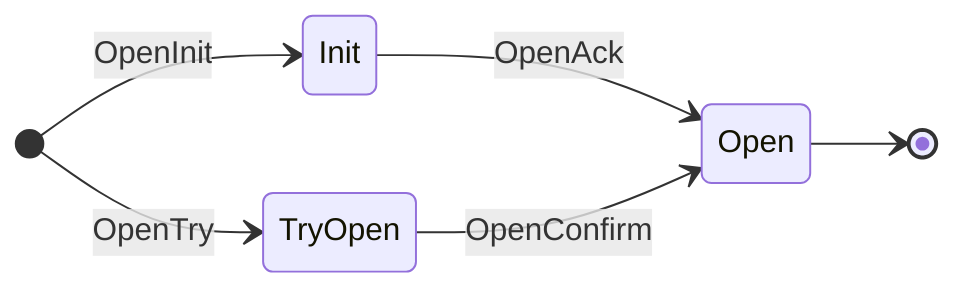

# Connection and Channel Lifecycle

Each proof-bearing handshake and packet entry point verifies a path and value
against the registered counterparty client at `msg.ProofHeight`.

| Entry point | Proof type | Verified path | Verified value | Local mutation after proof |
|-------------|------------|---------------|----------------|----------------------------|
| `ConnectionOpenInit` | none | n/a | n/a | Allocates `connectionId`, saves `Connection{Init, ClientId, CounterpartyClientId, 0}`, and emits. |
| `ConnectionOpenTry` | membership | `ConnectionPath(msg.CounterpartyConnectionId)` | `keccak(Connection{Init, msg.CounterpartyClientId, msg.ClientId, 0}.EthAbiEncode())` | Allocates `connectionId`, saves `Connection{TryOpen, ...}`, and emits. |
| `ConnectionOpenAck` | membership | `ConnectionPath(msg.CounterpartyConnectionId)` | `keccak(Connection{TryOpen, connection.CounterpartyClientId, connection.ClientId, msg.ConnectionId}.EthAbiEncode())` | Transitions to `Open`, stores the counterparty connection id, and emits. |
| `ConnectionOpenConfirm` | membership | `ConnectionPath(connection.CounterpartyConnectionId)` | `keccak(Connection{Open, connection.CounterpartyClientId, connection.ClientId, msg.ConnectionId}.EthAbiEncode())` | Transitions to `Open` and emits. |
| `ChannelOpenInit` | none | n/a | n/a | Allocates `channelId`, records the port owner, calls `OnChannelOpenInit`, saves `Channel{Init, ...}`, and emits. |
| `ChannelOpenTry` | membership | `ChannelPath(msg.Channel.CounterpartyChannelId)` | `keccak(Channel{Init, connection.CounterpartyConnectionId, 0, msg.PortId, msg.CounterpartyVersion}.EthAbiEncode())` | Allocates `channelId`, records the port owner, calls `OnChannelOpenTry`, saves `Channel{TryOpen, ...}`, and emits. |
| `ChannelOpenAck` | membership | `ChannelPath(msg.CounterpartyChannelId)` | `keccak(Channel{TryOpen, connection.CounterpartyConnectionId, msg.ChannelId, portId, msg.CounterpartyVersion}.EthAbiEncode())` | Calls `OnChannelOpenAck`, transitions to `Open`, stores the counterparty channel id and version, and emits. |
| `ChannelOpenConfirm` | membership | `ChannelPath(channel.CounterpartyChannelId)` | `keccak(Channel{Open, connection.CounterpartyConnectionId, msg.ChannelId, portId, channel.Version}.EthAbiEncode())` | Calls `OnChannelOpenConfirm`, transitions to `Open`, and emits. |
| `PacketRecv` | membership | `BatchPacketsPath(CommitPackets(msg.Packets))` | `COMMITMENT_MAGIC` | Per packet, writes a receipt, calls `OnRecvPacket`, optionally commits a sync ack, and emits. |
| `PacketAcknowledgement` | membership | `BatchReceiptsPath(CommitPackets(msg.Packets))` | `CommitAcks(msg.Acknowledgements)` | Per packet, calls `OnAcknowledgementPacket`, deletes the source commitment, and emits. |
| `PacketTimeout` | non-membership | `BatchReceiptsPath(CommitPacket(msg.Packet))` | n/a | Calls `OnTimeoutPacket`, deletes the source commitment, and emits. |

For connection and channel handshakes, the verified value is the counterparty's
expected committed state from the opposite perspective. Core reconstructs that
counterparty state from the local record, relayer-supplied message fields, and
the next expected handshake state, ABI-encodes it, hashes it, and verifies the
hash at the counterparty path.

In the table, `connection` and `channel` refer to locally stored records loaded
during the entry point. `portId` is the channel owner resolved from the local
channel owner store.

For packet flows, the verified value is a commitment sentinel or acknowledgement
hash rather than an encoded connection or channel record. `PacketRecv` proves
the source committed the packet batch. `PacketAcknowledgement` proves the
destination committed the ack batch. `PacketTimeout` proves the destination
receipt path is absent.

Connections follow the standard four-step handshake:

- `ConnectionOpenInit`
- `ConnectionOpenTry`
- `ConnectionOpenAck`
- `ConnectionOpenConfirm`

`ConnectionOpenInit` emits before a counterparty connection id is known:

Example emission:

```json
{
  "type": "ConnectionOpenInit",
  "attrs": [
    {
      "key": "connection_id",
      "value": "1"
    },
    {
      "key": "client_id",
      "value": "1"
    },
    {
      "key": "counterparty_client_id",
      "value": "7"
    }
  ],
  "pkg_path": "gno.land/r/core/ibc/v1/core"
}
```

`ConnectionOpenTry` includes the counterparty connection id. `ConnectionOpenAck`
and `ConnectionOpenConfirm` share this four-attribute shape:

Example emission:

```json
{
  "type": "ConnectionOpenTry",
  "attrs": [
    {
      "key": "connection_id",
      "value": "1"
    },
    {
      "key": "client_id",
      "value": "1"
    },
    {
      "key": "counterparty_client_id",
      "value": "7"
    },
    {
      "key": "counterparty_connection_id",
      "value": "3"
    }
  ],
  "pkg_path": "gno.land/r/core/ibc/v1/core"
}
```

Channels follow the same handshake shape:

- `ChannelOpenInit`
- `ChannelOpenTry`
- `ChannelOpenAck`
- `ChannelOpenConfirm`

`ChannelOpenInit` records the calling app realm as the source port owner. The
counterparty channel identifier is only known after later handshake steps, so
the init event does not imply a final counterparty channel mapping.

Example emission:

```json
{
  "type": "ChannelOpenInit",
  "attrs": [
    {
      "key": "port_id",
      "value": "0x676e6f2e6c616e642f722f676e6f737761702f6962632f76312f617070732f7a6b676d"
    },
    {
      "key": "channel_id",
      "value": "1"
    },
    {
      "key": "counterparty_port_id",
      "value": "0x77617374312e2e2e"
    },
    {
      "key": "connection_id",
      "value": "1"
    },
    {
      "key": "connection_client_id",
      "value": "1"
    },
    {
      "key": "connection_counterparty_client_id",
      "value": "7"
    },
    {
      "key": "connection_counterparty_connection_id",
      "value": "3"
    },
    {
      "key": "version",
      "value": "ucs03-zkgm-0"
    }
  ],
  "pkg_path": "gno.land/r/core/ibc/v1/core"
}
```

The `port_id` value above is the hex encoding of `gno.land/r/gnoswap/ibc/v1/apps/zkgm`,
the ZKGM proxy pkgpath. The encoding rule for byte-valued identifiers is
documented in [Event Catalog](../events.md#attribute-encoding).

`ChannelOpenTry`, `ChannelOpenAck`, and `ChannelOpenConfirm` all include
`counterparty_channel_id` and share this nine-attribute shape:

Example emission:

```json
{
  "type": "ChannelOpenAck",
  "attrs": [
    {
      "key": "port_id",
      "value": "0x676e6f2e6c616e642f722f676e6f737761702f6962632f76312f617070732f7a6b676d"
    },
    {
      "key": "channel_id",
      "value": "1"
    },
    {
      "key": "counterparty_port_id",
      "value": "0x77617374312e2e2e"
    },
    {
      "key": "counterparty_channel_id",
      "value": "27"
    },
    {
      "key": "connection_id",
      "value": "1"
    },
    {
      "key": "connection_client_id",
      "value": "1"
    },
    {
      "key": "connection_counterparty_client_id",
      "value": "7"
    },
    {
      "key": "connection_counterparty_connection_id",
      "value": "3"
    },
    {
      "key": "version",
      "value": "ucs03-zkgm-0"
    }
  ],
  "pkg_path": "gno.land/r/core/ibc/v1/core"
}
```

Channel close entry points are present but unsupported. `ChannelCloseInit` and
`ChannelCloseConfirm` currently panic instead of transitioning channel state or
emitting close events.


