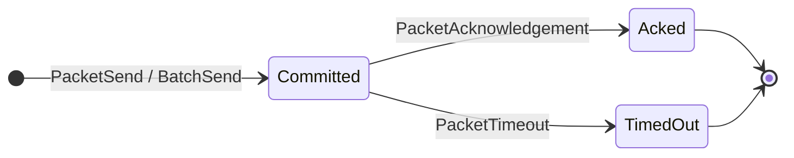
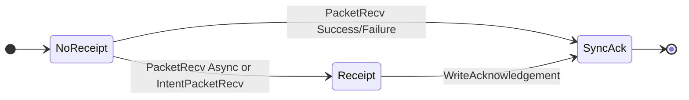

# Packet Lifecycle

`PacketSend` validates that the caller owns the source port, verifies that the
channel is open, commits the packet, and emits `PacketSend`.

Example emission:

```json
{
  "type": "PacketSend",
  "attrs": [
    {
      "key": "packet_hash",
      "value": "0x0000...000000"
    },
    {
      "key": "packet_data",
      "value": "0x0801..."
    },
    {
      "key": "source_channel_id",
      "value": "1"
    },
    {
      "key": "source_channel_version",
      "value": "ucs03-zkgm-0"
    },
    {
      "key": "source_connection_id",
      "value": "1"
    },
    {
      "key": "source_connection_client_id",
      "value": "1"
    },
    {
      "key": "destination_channel_id",
      "value": "27"
    },
    {
      "key": "destination_connection_id",
      "value": "3"
    },
    {
      "key": "destination_connection_client_id",
      "value": "7"
    },
    {
      "key": "timeout_timestamp",
      "value": "1750000000000000000"
    }
  ],
  "pkg_path": "gno.land/r/core/ibc/v1/core"
}
```

`BatchSend` validates a same-channel packet batch, commits all packet
commitments, emits `BatchSend`, and emits a per-packet `PacketSend` event.

Example emission:

```json
{
  "type": "BatchSend",
  "attrs": [
    {
      "key": "batch_hash",
      "value": "0x0000...000000"
    },
    {
      "key": "source_channel_id",
      "value": "1"
    },
    {
      "key": "source_channel_version",
      "value": "ucs03-zkgm-0"
    },
    {
      "key": "source_connection_id",
      "value": "1"
    },
    {
      "key": "source_connection_client_id",
      "value": "1"
    },
    {
      "key": "destination_channel_id",
      "value": "27"
    },
    {
      "key": "destination_connection_id",
      "value": "3"
    },
    {
      "key": "destination_connection_client_id",
      "value": "7"
    }
  ],
  "pkg_path": "gno.land/r/core/ibc/v1/core"
}
```

The batch event does not include `packet_hash`, `packet_data`, or
`timeout_timestamp`. Each child packet still emits its own `PacketSend` event
after the batch event.

`BatchAcks` commits multiple async acknowledgements for packets on the same
destination channel. It uses the same destination app ownership check as
`WriteAcknowledgement`.

`BatchAcks` writes only the aggregate batch entry under
`BatchReceiptsPath(batchHash)`. It does not update per-packet receipt entries,
so `HasAcknowledgement(_, packet)` for individual packets in the batch returns
false. No event is emitted. Consumers must observe the bulk commit by querying
batch receipt state directly.

`PacketRecv` verifies the packet batch proof against the destination channel's
client, rejects timed-out packets, skips packets that already have receipts,
dispatches `OnRecvPacket` to the destination app, and handles the returned
status:

- synchronous statuses write an acknowledgement immediately
- `PacketStatusAsync` records receipt state without writing the final
  acknowledgement

Example emission:

```json
{
  "type": "PacketRecv",
  "attrs": [
    {
      "key": "packet_hash",
      "value": "0x0000...000000"
    },
    {
      "key": "packet_data",
      "value": "0x0801..."
    },
    {
      "key": "source_channel_id",
      "value": "27"
    },
    {
      "key": "source_connection_id",
      "value": "3"
    },
    {
      "key": "source_connection_client_id",
      "value": "7"
    },
    {
      "key": "destination_channel_id",
      "value": "1"
    },
    {
      "key": "destination_channel_version",
      "value": "ucs03-zkgm-0"
    },
    {
      "key": "destination_connection_id",
      "value": "1"
    },
    {
      "key": "destination_connection_client_id",
      "value": "1"
    },
    {
      "key": "timeout_timestamp",
      "value": "1750000000000000000"
    },
    {
      "key": "maker_msg",
      "value": "0x"
    }
  ],
  "pkg_path": "gno.land/r/core/ibc/v1/core"
}
```

`IntentPacketRecv` uses the same receive-side shape, but the final attribute key
is `market_maker_msg` instead of `maker_msg`.

`IntentPacketRecv` is the market-maker receive path. It dispatches packet
handling without the normal proof and acknowledgement write flow.

`WriteAcknowledgement` is the async acknowledgement writer. Only the destination
app owner for the channel can write the acknowledgement.

Example emission:

```json
{
  "type": "WriteAck",
  "attrs": [
    {
      "key": "packet_hash",
      "value": "0x0000...000000"
    },
    {
      "key": "packet_data",
      "value": "0x0801..."
    },
    {
      "key": "source_channel_id",
      "value": "27"
    },
    {
      "key": "source_connection_id",
      "value": "3"
    },
    {
      "key": "source_connection_client_id",
      "value": "7"
    },
    {
      "key": "destination_channel_id",
      "value": "1"
    },
    {
      "key": "destination_channel_version",
      "value": "ucs03-zkgm-0"
    },
    {
      "key": "destination_connection_id",
      "value": "1"
    },
    {
      "key": "destination_connection_client_id",
      "value": "1"
    },
    {
      "key": "timeout_timestamp",
      "value": "1750000000000000000"
    },
    {
      "key": "acknowledgement",
      "value": "0x0a200000...000000"
    }
  ],
  "pkg_path": "gno.land/r/core/ibc/v1/core"
}
```

Sync acknowledgements come from `PacketRecv` when the app returns a non-async
status. Async acknowledgements come from `WriteAcknowledgement`, including ZKGM
forward parent resolution through `WriteForwardAck`.

`PacketAcknowledgement` verifies acknowledgement membership, deletes the source
packet commitment, dispatches the source app acknowledgement callback, and emits
`PacketAck`.

`PacketTimeout` verifies non-membership of the destination receipt after the
timeout condition is met, deletes the source packet commitment, dispatches the
source app timeout callback, and emits `PacketTimeout`.

`PacketTimeout` is a no-op when no source commitment exists for the packet,
which makes retried timeout calls idempotent.

Replay protection is hash-based. If two packets have the same source channel,
destination channel, data, and timeout timestamp, they have the same packet hash
and the second receive sees the existing receipt.




