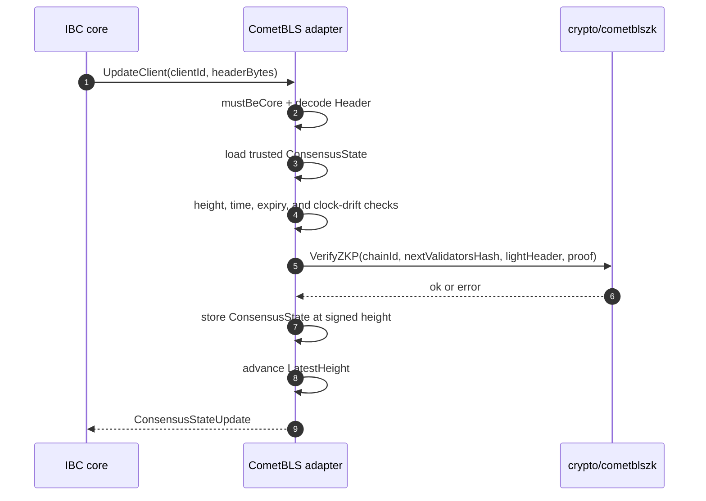
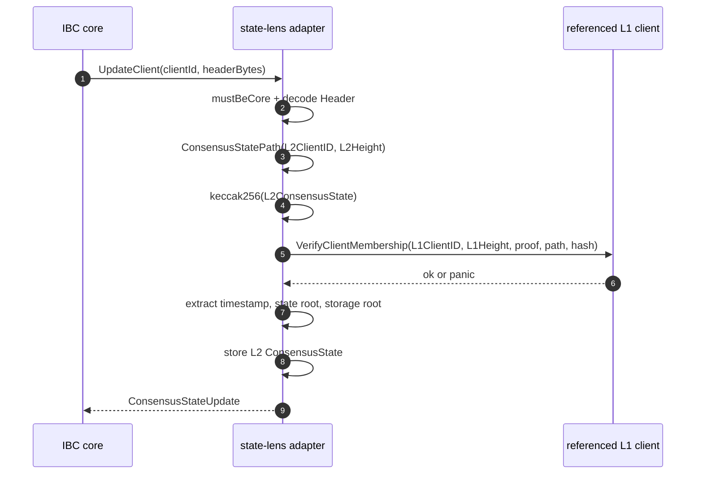
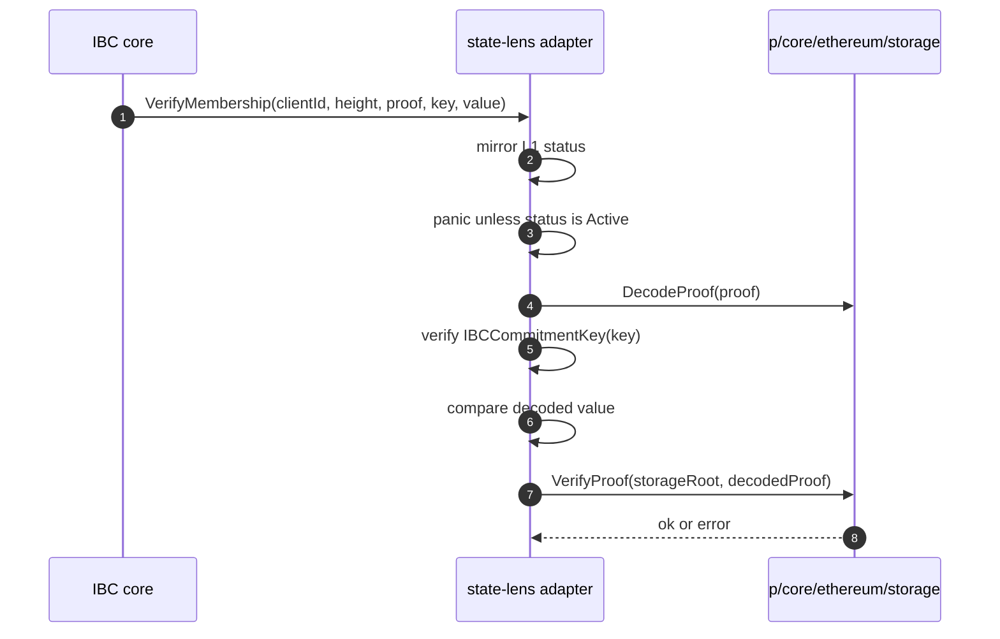

# Light Clients Spec

This document describes the current v1 light-client adapter model and the
implemented adapters under
[gno.land/r/core/ibc/v1/lightclients](../../gno.land/r/core/ibc/v1/lightclients)
and [gno.land/p/core/ibc/lightclients](../../gno.land/p/core/ibc/lightclients).

## Scope

IBC core stores light-client implementations by client type. Each implementation
is a realm adapter that translates core calls into client-specific state
transitions and proof verification.

Implemented v1 client types:

| Client type | Adapter realm | Stateless package |
|-------------|---------------|-------------------|
| `cometbls` | `gno.land/r/core/ibc/v1/lightclients/cometbls` | `gno.land/p/core/ibc/lightclients/cometbls` |
| `state-lens/ics23/mpt` | `gno.land/r/core/ibc/v1/lightclients/statelensics23mpt` | `gno.land/p/core/ibc/lightclients/statelensics23mpt` |

## Adapter Contract

IBC core calls adapters through `core.ILightClient`:

```gno
type ILightClient interface {
    CreateClient(_ realm, clientId ClientId, clientStateBytes, consensusStateBytes []byte) string
    UpdateClient(_ realm, clientId ClientId, clientMessage []byte) ConsensusStateUpdate
    VerifyMembership(clientId ClientId, height Height, proof []byte, key []byte, value []byte)
    VerifyNonMembership(clientId ClientId, height Height, proof []byte, key []byte)
    GetTimestamp(clientId ClientId, height Height) Timestamp
    GetLatestHeight(clientId ClientId) Height
    GetStatus(clientId ClientId) Status
}
```

Methods that mutate adapter state take `realm` so core can call them with
`cross(cur)`. Proof verification and query methods are read-only from the
adapter's perspective.

`core.IForceLightClient` is optional:

```gno
type IForceLightClient interface {
    ForceUpdateClient(cur realm, clientId ClientId, clientStateBytes, consensusStateBytes []byte) ConsensusStateUpdate
}
```

Core exposes force update only through `core.ForceUpdateClient`, which requires
the core deployer and an origin call. The adapter still checks `mustBeCore`
after core dispatches the call, so force update has two separate guards.
CometBLS implements this optional interface. State-lens ICS23 MPT does not.

`core.Status` values are:

| Status | Value |
|--------|-------|
| `StatusUnknown` | `0` |
| `StatusActive` | `1` |
| `StatusExpired` | `2` |
| `StatusFrozen` | `3` |

Proof verification must reject inactive clients before decoding or verifying
proof bytes. This rule applies to both membership and non-membership proofs.

## Registration and Guards

Core registers adapters with:

```gno
func RegisterClient(_ realm, clientType ClientType, client ILightClient)
```

`CreateClient` picks an adapter by `ClientType`, calls the adapter's
`CreateClient`, and stores the encoded client and consensus state bytes in core.
`UpdateClient` calls the adapter, then stores the returned update in core.

Both implemented adapters use a core-only guard on mutating methods:

```gno
func mustBeCore(cur realm) {
    if cur.Previous().PkgPath() != "gno.land/r/core/ibc/v1/core" {
        panic(...)
    }
}
```

CometBLS guards `CreateClient`, `UpdateClient`, `Misbehaviour`, and
`ForceUpdateClient`. State-lens guards `CreateClient` and `UpdateClient`.
Read-only proof and query methods do not use `mustBeCore`.

## Module Layout

CometBLS realm files:

| File | Purpose |
|------|---------|
| `cometbls.gno` | Adapter state, core guard, `ILightClient`, `Misbehaviour`, and `ForceUpdateClient`. |
| `cometbls_test.gno` | Adapter tests for guards, status, force update, and state transitions. |

CometBLS package files:

| File | Purpose |
|------|---------|
| `types.gno` | `Height`, `ClientState`, `ConsensusState`, `LightHeader`, `Header`, and `Misbehaviour`. |
| `client.gno` | Status logic and membership proof helpers. |
| `verify.gno` | Header and misbehaviour verification. |
| `header.gno` | Header ABI encode and decode. |
| `consensus_state.gno` | Consensus state ABI encode and decode. |
| `client_state_pb_gen.gno` | Client state protobuf encode and decode. |
| `misbehaviour.gno` | Protobuf helpers for headers and misbehaviour support types. |
| `misbehaviour_pb_gen.gno` | Misbehaviour protobuf wrapper encode and decode. |
| `proofs.gno` | ICS23 chained proof verification. |

State-lens ICS23 MPT files:

| File | Purpose |
|------|---------|
| `statelensics23mpt.gno` | Adapter state, core guard, L1-referenced updates, and storage proof verification. |
| `statelensics23mpt_test.gno` | Adapter, status, proof, and packet-flow tests. |
| `types.gno` | `ClientState`, `ConsensusState`, and `Header`. |
| `ethabi.gno` | Solidity ABI encode and decode for state-lens wire types. |
| `ethabi_test.gno` | ABI vectors against Union reference data. |

## CometBLS Adapter

The CometBLS client type is `cometbls`.

The adapter stores one entry per core client id:

```gno
type clientEntry struct {
    consensusStates map[cometbls.Height]cometbls.ConsensusState
    cs              cometbls.ClientState
}
```

`cs` is the current client state. `consensusStates` stores trusted consensus
states by height. Updates look up the trusted consensus state at
`Header.TrustedHeight` and store a new consensus state at the signed header
height.

The adapter also has `wasmdModuleStoreKey = []byte("wasm")`. Membership and
non-membership verification prefix the key path with the wasmd module and the
configured WASM contract address before invoking the ICS23 verifier.

### CometBLS Entry Points

| Method | Guard | Behavior |
|--------|-------|----------|
| `NewAdapter` | none | Constructs an adapter value in the adapter realm. |
| `CreateClient` | `mustBeCore` | Decodes client and consensus state bytes, validates initialization, stores the initial entry, and returns `ChainID`. |
| `UpdateClient` | `mustBeCore` | Decodes a header, verifies it against the trusted consensus state, stores the new consensus state, advances `LatestHeight`, and returns encoded state updates. |
| `Misbehaviour` | `mustBeCore` | Decodes two conflicting headers, verifies both, freezes the client, and returns the encoded client state. |
| `ForceUpdateClient` | `mustBeCore`. Core also requires deployer and origin call before dispatch. | Replaces the client with a strictly newer state, preserves identity fields, clears frozen status, and discards old consensus states. |
| `VerifyMembership` | status-first check | Decodes ICS23 proofs, prefixes the wasmd path, and verifies membership against a stored consensus root. |
| `VerifyNonMembership` | status-first check | Decodes ICS23 proofs, prefixes the wasmd path, and verifies absence against a stored consensus root. |
| `GetTimestamp` | none | Returns the stored consensus timestamp at height. |
| `GetLatestHeight` | none | Returns `cs.LatestHeight`. |
| `GetStatus` | none | Maps CometBLS package status strings to `core.Status`. |

All mutating methods panic on invalid input. Read-only methods panic for missing
client or missing consensus state.

### CometBLS Wire Types

`ClientState` is protobuf encoded:

```gno
type ClientState struct {
    ChainID         string
    TrustingPeriod  uint64
    MaxClockDrift   uint64
    FrozenHeight    Height
    LatestHeight    Height
    ContractAddress H256
}
```

`TrustingPeriod` and `MaxClockDrift` are nanoseconds. `ContractAddress` is used
to build the wasmd merkle path during proof verification.

`ConsensusState` is Solidity ABI encoded:

```gno
type ConsensusState struct {
    Timestamp          uint64
    Root               MerkleRoot
    NextValidatorsHash H256
}
```

`Root.Hash` is the app hash. `NextValidatorsHash` is the validator set hash
that the next block height commits to.

`Header` is Solidity ABI encoded:

```gno
type LightHeader struct {
    Height             int64
    TimeSeconds        int64
    TimeNanos          int32
    ValidatorsHash     []byte
    NextValidatorsHash H256
    AppHash            []byte
}

type Header struct {
    SignedHeader       LightHeader
    TrustedHeight      Height
    ZeroKnowledgeProof []byte
}
```

`Misbehaviour` is protobuf encoded and contains two headers:

```gno
type Misbehaviour struct {
    HeaderA Header
    HeaderB Header
}
```

### CometBLS Status

The package-level status strings are `Active`, `Frozen`, and `Expired`.
`GetStatus` maps them to `StatusActive`, `StatusFrozen`, and `StatusExpired`.
Unknown package status maps to `StatusUnknown`.

CometBLS uses `FrozenHeight = 1` as the frozen sentinel. `ClientState.IsFrozen`
returns true whenever `FrozenHeight != 0`. Successful misbehaviour verification
sets `cs.FrozenHeight = FrozenHeight`.

Expiration is computed from the latest trusted consensus state's timestamp,
current block time, and `TrustingPeriod`.

### CometBLS Header Verification

`VerifyHeader(cs, trusted, header, nowNanos)` performs these checks:

1. Reject an already frozen client.
2. Require `SignedHeader.Height > TrustedHeight`.
3. Reject negative `TimeSeconds` or `TimeNanos`.
4. Require the header timestamp to be newer than the trusted consensus state.
5. Reject an expired trusted consensus state.
6. Reject a header timestamp beyond `nowNanos + MaxClockDrift`.
7. Call `crypto/cometblszk.VerifyZKP` with `ChainID`,
   `trusted.NextValidatorsHash`, the canonicalized light header, and the
   supplied Groth16 proof.

The trusted validator input is `trusted.NextValidatorsHash`, which is the
validator set committed at `TrustedHeight` for the next height.



### CometBLS Misbehaviour

`VerifyMisbehaviour` requires two headers at the same signed height. The headers
must differ in content. Each header must independently pass `VerifyHeader`
against its trusted consensus state. If both verify, the adapter freezes the
client by setting `FrozenHeight = 1`.

`Misbehaviour` is not part of `core.ILightClient`. The CometBLS adapter exposes
it as a dedicated entry point guarded by `mustBeCore`. Core does not currently
route misbehaviour through the light-client interface.

### CometBLS Proof Verification

CometBLS membership proofs are ICS23 chained proofs. The adapter first checks
that the client status is active. Only then does it decode proof bytes.

For membership:

1. Decode ICS23 proofs.
2. Build a merkle path with `wasm` and
   `0x03 || ContractAddress || 0x00 || key`.
3. Verify the chained existence proofs from leaf to app-hash root.
4. Require the final subroot to match `ConsensusState.Root.Hash`.

For non-membership:

1. Decode ICS23 proofs.
2. Require the first proof to be a non-existence proof.
3. Verify the non-existence proof.
4. Verify the remaining chained existence proofs up to the app-hash root.

The proof verifier clones proof and path data before passing them to helpers
that may mutate internal proof state.

### CometBLS Crypto Bindings

The CometBLS hot path imports `crypto/cometblszk`, not `crypto/cometbls`.
`crypto/cometblszk.VerifyZKP` is the current realm-side Groth16 verifier. It
uses BN254 operations, modular exponentiation, and Keccak internally.

`crypto/cometbls` exposes a parallel `VerifyZKP` API as a native reference
binding, but `verify.gno` does not call it.

## State-Lens ICS23 MPT Adapter

The state-lens client type is `state-lens/ics23/mpt`.

State-lens is a conditional light client. It does not verify validator sets.
Instead, it relies on a referenced L1 client to prove that an L2 consensus state
hash is committed on L1. The adapter then extracts L2 roots from the verified
consensus state bytes and uses the L2 storage root to verify Ethereum MPT
storage proofs.

The adapter stores one entry per core client id:

```gno
type clientEntry struct {
    consensusStates map[statelens.Height]statelens.ConsensusState
    cs              statelens.ClientState
}
```

### State-Lens Wire Types

`ClientState` is Solidity ABI encoded:

```gno
type ClientState struct {
    L2ChainID         string
    L1ClientID        uint32
    L2ClientID        uint32
    L2LatestHeight    Height
    TimestampOffset   uint16
    StateRootOffset   uint16
    StorageRootOffset uint16
}
```

`L1ClientID` is the local Gno client that tracks the settlement chain.
`L2ClientID` is the client on the settlement chain that tracks the L2 chain.
The three offsets tell the adapter where to read timestamp, state root, and
storage root from the raw L2 consensus state bytes.

`ConsensusState` is Solidity ABI encoded:

```gno
type ConsensusState struct {
    Timestamp   uint64
    StateRoot   []byte
    StorageRoot []byte
}
```

`StateRoot` is captured for completeness. `VerifyMembership` and
`VerifyNonMembership` anchor proofs to `StorageRoot`.

`Header` is Solidity ABI encoded:

```gno
type Header struct {
    L1Height              Height
    L2Height              Height
    L2ConsensusStateProof []byte
    L2ConsensusState      []byte
}
```

### State-Lens Entry Points

| Method | Guard | Behavior |
|--------|-------|----------|
| `NewAdapter` | none | Constructs an adapter value in the adapter realm. |
| `CreateClient` | `mustBeCore` | Decodes client and consensus state bytes, stores the initial entry, and returns `L2ChainID`. |
| `UpdateClient` | `mustBeCore` | Verifies the L2 consensus state hash through the L1 client, extracts roots by offset, stores the L2 consensus state, and advances `L2LatestHeight`. |
| `VerifyMembership` | status-first check | Decodes an Ethereum storage proof and verifies a 32-byte value against the stored storage root. |
| `VerifyNonMembership` | status-first check | Decodes an Ethereum storage proof and verifies absence against the stored storage root. |
| `GetTimestamp` | none | Returns the stored L2 consensus timestamp at height. |
| `GetLatestHeight` | none | Returns `cs.L2LatestHeight`. |
| `GetStatus` | none | Mirrors the referenced L1 client status and maps missing L1 to frozen. |

State-lens does not implement `Misbehaviour` or `ForceUpdateClient`.

### State-Lens Update Flow

State-lens update verifies that the referenced L1 client has committed the L2
consensus state hash:

1. Decode `Header`.
2. Build `ConsensusStatePath(L2ClientID, L2Height)`.
3. Compute `keccak256(L2ConsensusState)`.
4. Call `core.VerifyClientMembership(L1ClientID, L1Height, proof, path, hash)`.
5. Extract timestamp, state root, and storage root from `L2ConsensusState`
   using the offsets in client state.
6. Store the extracted consensus state at `L2Height`.
7. Advance `L2LatestHeight` when `L2Height` is newer.

The verified value is the Keccak hash of the encoded L2 consensus state, not
the raw L2 consensus state bytes.

`core.VerifyClientMembership` is a core wrapper that dispatches to the
registered L1 adapter's `VerifyMembership` method without writing verified
state into the core realm.



### State-Lens Status

State-lens status mirrors the referenced L1 client:

```gno
status := core.GetClientStatus(L1ClientID)
if status == core.StatusUnknown {
    return core.StatusFrozen
}
return status
```

The state-lens client has no independent frozen height. Missing L1 client state
fails closed as `StatusFrozen`. Frozen or expired L1 status disables state-lens
membership and non-membership proof verification.

### State-Lens Proof Verification

State-lens proof verification uses `gno.land/p/core/ethereum/storage`, not
ICS23. The proof root is the stored L2 `ConsensusState.StorageRoot`.

For membership:

1. Mirror L1 status and require `StatusActive`.
2. Load the L2 consensus state at the requested height.
3. Decode the Ethereum storage proof.
4. Derive the expected storage key with `storage.IBCCommitmentKey(path)`.
5. Require the decoded proof key to match the expected key.
6. Require `value` to be exactly 32 bytes.
7. Require the decoded stored value to equal `value`.
8. Call `storage.VerifyProof(StorageRoot, proof)`.

For non-membership:

1. Mirror L1 status and require `StatusActive`.
2. Load the L2 consensus state at the requested height.
3. Decode the Ethereum storage proof.
4. Verify the commitment key.
5. Call `storage.VerifyAbsence(StorageRoot, proof)`.



## Binding Summary

The current light-client code uses these local stdlib bindings and helper
packages:

| Binding or package | Used in |
|---------|---------|
| `crypto/cometblszk.VerifyZKP` | CometBLS header and misbehaviour verification. |
| `crypto/keccak256.Sum256` | State-lens update and CometBLS ZK public input helpers. |
| `crypto/bn254` | Internal Groth16 verification in `crypto/cometblszk`. |
| `crypto/modexp` | Field arithmetic inside `crypto/cometblszk`. |
| `crypto/merkle` | CometBLS ICS23 proof helpers. |
| `gno.land/p/core/ethereum/storage` | State-lens Ethereum storage proof decode, membership, absence, and commitment-key derivation. |

The repository currently carries these bindings under `stdlibs/` as a local
toolchain overlay. See
[Native Stdlibs and Toolchain](native-stdlibs-toolchain.md) for maintenance
rules.

## Implementation Rules

- New v1 adapters must implement `core.ILightClient`.
- Mutating adapter entry points must be guarded so only IBC core can call them.
- `VerifyMembership` and `VerifyNonMembership` must check active status before
  decoding proof bytes.
- Adapter-level checks do not replace inner-client checks. Inner clients should
  still enforce conditions they can determine without caller context.
- New adapter tests should cover frozen or expired clients for both membership
  and non-membership verification.
- Adapters must clone or otherwise protect proof and path slices before passing
  them to helpers that may mutate input data.

## Implementation Differences

| Area | Current behavior |
|------|------------------|
| Adapter boundary | Adapters are realm implementations registered under a client type in IBC core. |
| Mutating calls | Both adapters require the previous realm to be IBC core. |
| Misbehaviour | CometBLS exposes adapter-only misbehaviour. It is not part of `core.ILightClient`. |
| Force update | CometBLS implements `IForceLightClient`. State-lens does not. |
| CometBLS verifier | The hot path uses `crypto/cometblszk`, not the `crypto/cometbls` native reference binding. |
| CometBLS proofs | Membership and non-membership use ICS23 chained proofs with a wasmd contract-store path prefix. |
| State-lens trust model | State-lens delegates consensus security to the referenced L1 client. |
| State-lens missing L1 | Missing L1 client status maps to `StatusFrozen`. |
| State-lens proofs | Membership and non-membership use Ethereum MPT storage proofs anchored to `StorageRoot`. |

Out-of-scope behavior includes core-interface misbehaviour dispatch, ordered
light-client proof semantics, 08-wasm host binding behavior, and multiple
parallel L1 anchors for a single state-lens client.

## Maintenance Notes

This spec tracks current adapter behavior only. Keep historical design notes and
uncommitted design material out of this document. When adapter behavior changes,
update this spec together with the code or test that proves the new behavior.
