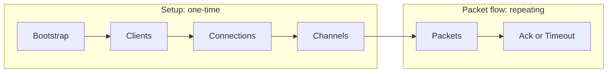

# IBC Overview

This overview is the entry point for the gno-ibc implementation specs. It
introduces the IBC concepts used throughout, then maps those concepts to the
realms and packages in this repository.

## What is IBC

IBC is a protocol for trust-minimized packet relay between sovereign chains. A
chain does not need to run a full node for its counterparty. Instead, it stores
a light client for the counterparty and verifies proofs against that light
client before accepting cross-chain state claims.

The protocol is organized around a small set of transport concepts. Light
clients answer whether counterparty state is valid. Connections bind client
identities together. Channels provide named application conduits over
connections. Packets carry application data through channels. Acknowledgements
report the receiving application's result back to the sending side.

Applications sit above this transport layer. The core protocol treats packet
data as opaque bytes, while each application decides how to encode, execute,
acknowledge, and time out its own messages.

gno-ibc is a Gno-realm implementation of that protocol surface. It expresses
IBC core state, light-client adapters, and applications as Gno realms and
packages with package-path based identities.

## How gno-ibc Implements IBC

The stack has one IBC core realm, one or more light-client adapter realms, and
application realms. The core realm owns protocol state and dispatches to
registered adapters and apps. Adapter realms verify counterparty headers and
proofs for specific client types. Application realms register ports and receive
callbacks when packets arrive, are acknowledged, or time out.

The current application family is ZKGM. Its public app realm is the ZKGM proxy,
published under `gno.land/r/gnoswap/ibc/v1/apps/zkgm`. The implementation realm
contains the instruction dispatcher for call, token order, batch, and forward
messages.

For topology details, see [Architecture](architecture.md). The spec index is in
[docs/specs/README.md](README.md).

## Light Clients

A light client is a state machine that lets one chain verify the headers of
another chain without running that chain's full node. It tracks enough
counterparty consensus state to answer two questions for a proof height:

- Is this membership proof valid for the committed key and value?
- Is this non-membership proof valid for the committed key?

gno-ibc registers light-client adapters by client type. Core stores the client
type for each client identifier, then dispatches create, update, status, proof,
timestamp, and height calls to the registered adapter.

The status model has four values. Active clients may verify proofs. Expired
clients are outside their validity window. Frozen clients are disabled because
misbehaviour was detected or an adapter-specific invariant failed. Unknown is a
sentinel returned for client identifiers that have no registered status.

The implemented client types are:

| Client type | Role |
|-------------|------|
| `cometbls` | Verifies CometBLS headers and ICS23 proofs for a CometBLS counterparty. |
| `state-lens/ics23/mpt` | Verifies an L2 state root through an L1 light client, then checks Ethereum storage proofs. |

See [Light Clients](light-clients.md) for adapter interfaces, status handling,
and proof verification rules.

## Connections

A connection is an authenticated link between two client identities. It says
that one chain's local client corresponds to a counterparty client on the other
chain, and that both sides have proven the same relationship.

Connections are established through a four-step handshake:

1. The initiating chain opens a local connection in init state.
2. The counterparty verifies that state and opens its matching connection in try
   state.
3. The initiating chain verifies the counterparty state and moves to open.
4. The counterparty verifies the acknowledgement and moves to open.

In gno-ibc, a connection stores the local client id, the counterparty client id,
and the counterparty connection id. Channels later bind to opened connections.

See [Connection and Channel Lifecycle](ibc-v1-core/connection-channel-lifecycle.md) for connection entry points and state
commitments.

## Channels

A channel is a named and versioned conduit for application packets. It runs on
top of a connection and belongs to a port.

Port ownership is package-path based. The port identifier is the package path of
the owning application realm. During channel opening, core records which port
owns the channel. Later packet sends must come from that same port owner.

Channels also use a four-step handshake:

1. The source app opens a channel on its port.
2. The counterparty verifies the opening state and records its own channel.
3. The source verifies the counterparty state and marks the channel open.
4. The counterparty verifies the confirmation and marks its channel open.

The IBC protocol defines channel close paths. The current gno-ibc channel close
entry points panic as unsupported, and close events are defined but not emitted.

See [Connection and Channel Lifecycle](ibc-v1-core/connection-channel-lifecycle.md) for channel entry points, port ownership, and
close behavior.

## Packets and Acknowledgements

A packet is opaque application data sent through an open channel. Core records a
packet commitment on the source side, verifies that commitment on the
destination side, then records the destination result as a receipt or
acknowledgement.

The packet-side states are:

| State | Meaning |
|-------|---------|
| Committed | The source side stored a packet commitment after send. |
| Received | The destination side recorded that the packet was received. |
| Acknowledged | The destination side stored an acknowledgement for the packet. |

gno-ibc supports three receive outcomes:

| Outcome | Meaning |
|---------|---------|
| Synchronous success | The application succeeds and returns an acknowledgement immediately. |
| Synchronous failure | The application fails and returns an error acknowledgement immediately. |
| Asynchronous | The application records receipt now and writes the acknowledgement later. |

Timeout is the source-side fallback when no destination receipt exists before
the packet timeout. A timeout call verifies non-membership of the destination
receipt, deletes the source commitment, and dispatches the app timeout callback.

The market-maker path uses `IntentPacketRecv`. Market-maker actors fill
packets out-of-protocol, so this path bypasses proof verification by design and
relies on the application callback to decide whether the intent is acceptable.

Core also exposes batch entry points. `BatchSend` records one aggregate packet
commitment. `BatchAcks` records one aggregate acknowledgement entry. The focused
core spec explains the state layout and observability implications.

See [Packet Lifecycle](ibc-v1-core/packet-lifecycle.md) for packet entry points and [Event Catalog](events.md)
for relayer and indexer observability.

## Applications

An application is a realm that registers a port and implements the core app
callback interface. Core calls the application during channel opening, packet
receive, intent receive, acknowledgement, and timeout.

Registration is package-path based. An app registers its port id with core, and
the port id is the package path that later owns channels and packet sends.

ZKGM is the current application family. It is a cross-chain messaging app with
instruction families for calls, token orders, batches, and forwards. The proxy
realm owns persistent state and the registered port. The implementation realm
executes the instruction dispatcher selected by the proxy.

At the conceptual level, ZKGM lets a user encode an instruction, send it through
IBC as packet data, and have the destination implementation execute or route it
according to the instruction family. Core only transports and authenticates the
packet. ZKGM defines the packet payload and acknowledgement semantics.

See [ZKGM v1 App](zkgm-v1/README.md) for the proxy, implementation, instruction
families, and packet behavior.

## Lifecycle at a Glance

IBC traffic only starts after registries, clients, connections, and channels are
in place. The setup phases create the authenticated path; the packet phase uses
that path to move application data and complete it with an acknowledgement or a
timeout.

| Phase | Representative actions | Typical actor | Resulting state | Proof check |
|-------|------------------------|---------------|-----------------|-------------|
| Bootstrap | `RegisterClient`, `RegisterApp`, `RegisterClientForType`, `RegisterAppForPort` | Owning adapter/app realm, or deployer loader realm for explicit registration | Registered client adapters and app ports | n/a |
| Clients | `CreateClient`, `UpdateClient` | Setup realm, operator, relayer | Light clients with counterparty consensus states | n/a |
| Connections | `ConnectionOpenInit`, `ConnectionOpenTry`, `ConnectionOpenAck`, `ConnectionOpenConfirm` | Operator and relayer | Open connection | Counterparty connection state exists |
| Channels | `ChannelOpenInit`, `ChannelOpenTry`, `ChannelOpenAck`, `ChannelOpenConfirm` | App realm and relayer | Open app-owned channel | Counterparty channel state exists |
| Packets | `PacketSend`, `PacketRecv` | App realm and relayer | Source packet commitment and destination receive result | Source packet commitment exists |
| Ack or Timeout | `PacketAcknowledgement`, `PacketTimeout` | Relayer | Source packet commitment removed | Destination acknowledgement exists, or destination receipt is absent |

Bootstrap, client, connection, and channel phases create the authenticated path.
Packet traffic then repeats over that path: each packet is closed on the source
side by either an acknowledgement proof or a timeout proof.

See [Architecture](architecture.md) for realm topology and detailed lifecycle sequences.

## Glossary

| Term | Definition |
|------|------------|
| Acknowledgement | Destination-side result bytes that report how an application handled a packet. |
| Adapter | A light-client realm that implements the core-facing client interface for one client type. |
| Application | A realm that owns a port and defines packet payload and callback semantics. |
| Channel | A named, versioned conduit for application packets over a connection. |
| Channel owner | The app port package path recorded as the owner of a channel. |
| Client identifier | The numeric id allocated by core for one light-client instance. |
| Client type | The registry key that selects a light-client adapter. |
| Connection | An authenticated link between local and counterparty client identities. |
| Counterparty | The chain, client, connection, channel, or port on the other side of an IBC relationship. |
| Deployer | The account allowed to perform selected privileged maintenance operations. |
| Frozen client | A client disabled because misbehaviour or an adapter invariant prevents safe verification. |
| Intent receive | A market-maker receive path that bypasses proof verification and relies on app validation. |
| Light client | A verifier for counterparty headers, state roots, and membership questions. |
| Market maker | An actor that submits intent receive calls for application-level settlement. |
| Membership proof | Proof that a key and value exist under a committed counterparty state root. |
| Non-membership proof | Proof that a key is absent under a committed counterparty state root. |
| Packet | Opaque application data sent through an open channel. |
| Packet commitment | Source-side commitment proving that a packet was sent. |
| Packet receipt | Destination-side marker proving that a packet was received. |
| Port | Application identifier used by core for channel ownership and callback dispatch. |
| Port owner | The app realm package path that owns a registered port. |
| Proof height | Counterparty height whose committed state root is used to verify a proof. |
| Realm | A stateful Gno contract package under `gno.land/r/...`. |
| Registered receiver | ZKGM receiver realm registered to accept call instructions. |
| Relayer | Off-chain actor that observes events and submits packets, acknowledgements, and timeouts. |
| Status | Light-client state category. gno-ibc uses active, expired, frozen, and an unknown sentinel for unregistered ids. |
| Timeout | Source-side packet completion path used when the destination receipt is absent. |
| Trusting period | Time window during which a light client accepts counterparty consensus state. |
| Wire packet | Encoded packet bytes used by core for commitment and proof, and by relayers for transport. |

## Further Reading

- [Interchain Standards specifications](https://github.com/cosmos/ibc)
- [Cosmos IBC documentation](https://docs.cosmos.network/ibc/latest/ibc/overview)
