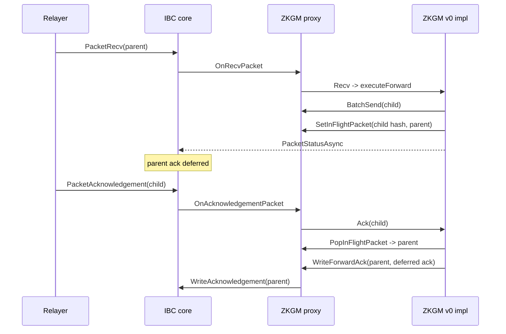

# ZKGM v1 App Spec

This document describes the current ZKGM v1 implementation. It covers the
proxy realm under
[gno.land/r/core/ibc/v1/apps/zkgm](../../gno.land/r/core/ibc/v1/apps/zkgm),
the active implementation under
[gno.land/r/core/ibc/v1/apps/zkgm/v0/impl](../../gno.land/r/core/ibc/v1/apps/zkgm/v0/impl),
and the stateless ABI package under
[gno.land/p/core/ibc/zkgm](../../gno.land/p/core/ibc/zkgm).

The filesystem paths use `gno.land/*/core/...`, but the import paths published
by `gnomod.toml` use the `gnoswap` namespace:

- `gno.land/r/gnoswap/ibc/v1/apps/zkgm`
- `gno.land/r/gnoswap/ibc/v1/apps/zkgm/v0/impl`
- `gno.land/r/gnoswap/ibc/v1/apps/zkgm/v0/loader`
- `gno.land/p/gnoswap/ibc/zkgm`

## Scope

ZKGM is implemented as a stateful proxy realm plus an implementation realm. The
proxy owns all persistent app state, registers with IBC core, exposes public
send and admin entry points, and delegates instruction behavior to the active
implementation. The `v0/impl` realm contains the current dispatcher and opcode
handlers.

The public app surface includes:

- `Send` for structured ZKGM instructions
- `SendRaw` for CLI-friendly primitive arguments
- IBC app callbacks for channel lifecycle, receive, intent receive,
  acknowledgement, and timeout
- proxy state management through implementation, admin, receiver, ledger, and
  forward acknowledgement helpers

The channel version is `ucs03-zkgm-0`. `OnChannelOpenInit` and
`OnChannelOpenTry` reject any other local version. `OnChannelOpenTry` also
checks the counterparty version.

## Module Layout

| Module path | Filesystem path | Role |
|-------------|-----------------|------|
| `gno.land/r/gnoswap/ibc/v1/apps/zkgm` | `gno.land/r/core/ibc/v1/apps/zkgm/` | Proxy realm. Owns persistent app state and registers with IBC core. |
| `gno.land/r/gnoswap/ibc/v1/apps/zkgm/v0/impl` | `gno.land/r/core/ibc/v1/apps/zkgm/v0/impl/` | Active implementation. Provides dispatchers and opcode handlers. |
| `gno.land/r/gnoswap/ibc/v1/apps/zkgm/v0/loader` | `gno.land/r/core/ibc/v1/apps/zkgm/v0/loader/` | Initialization glue. Installs the implementation and registers the proxy app. |
| `gno.land/p/gnoswap/ibc/zkgm` | `gno.land/p/core/ibc/zkgm/` | Stateless ABI types, constants, path helpers, salt helpers, and event constants. |

Key proxy files:

| File | Purpose |
|------|---------|
| `proxy.gno` | Implementation pointer, receiver registry, proxy helpers, `BatchSend`, `WriteForwardAck`, and native release. |
| `ledger.gno` | Token origin, metadata image, channel balance, in-flight packet, and token bucket stores. |
| `admin.gno` | Admin, pause, rate-limit configuration, and global rate-limit toggle. |
| `app.gno` | `core.IApp` implementation and callback routing. |
| `send.gno` | Public `Send`, `SendRaw`, native coin capture, and core `PacketSend`. |
| `query.gno` | `GetConfig` and `Render`. |
| `types.gno` | Proxy interfaces, request types, in-flight types, update request, and config snapshot. |

Key implementation files:

| File | Purpose |
|------|---------|
| `impl.gno` | `ZkgmV1` singleton, `Send`, `Recv`, `IntentRecv`, `Ack`, `Timeout`, and rendering. |
| `dispatch.gno` | Shared verify, execute, ack, and timeout dispatchers. |
| `call.gno` | `OP_CALL` receiver dispatch and call acknowledgements. |
| `token_order.gno` | `OP_TOKEN_ORDER` verify, execution, refund, and settlement logic. |
| `batch.gno` | `OP_BATCH` child dispatch, batch acknowledgements, and child timeouts. |
| `forward.gno` | `OP_FORWARD` child packet construction and deferred parent ack resolution. |
| `channel_balance.gno` | Channel balance key construction and balance updates. |
| `predict.gno` | Wrapped token and call proxy account derivation. |
| `voucher.gno` | GRC20 voucher creation, minting, and burning. |
| `coins.gno` | Native sent-coin parsing and exact-match checks. |

## Proxy State

All durable ZKGM state lives in the proxy realm. The active implementation is
stateless apart from the package-level `ZkgmV1` singleton.

| State | Type | Purpose |
|-------|------|---------|
| `impl` | `ZkgmImpl` | Active implementation object. |
| `implPath` | `string` | Pkgpath that installed the current implementation. |
| `allowedImpls` | `[]string` | Whitelist for implementation and loader realms. Empty means bootstrap mode. |
| `paused` | `bool` | Global pause flag. |
| `gRealmAddress` | `address` | Cached proxy realm address. |
| `adminAddressStr` | `string` | Admin address string. Empty means admin bootstrap mode. |
| `receivers` | BPTree map | Registered `Zkgmable` receivers by pkgpath. |
| `tokenOrigin` | BPTree map | Wrapped denom to mint path. |
| `metadataImageOf` | BPTree map | Wrapped denom to metadata image. |
| `channelBalanceV2` | BPTree map | Escrow balance by channel, path, base token, and quote token. |
| `inFlightPackets` | BPTree map | Forwarded child packet hash to parent packet. |
| `tokenBucket` | BPTree map | Per-denom rate-limit bucket. |
| `rateLimitDisabled` | `bool` | Global rate-limit kill switch. |

The current ledger has only `channelBalanceV2`. There is no `channelBalanceV1`
store in committed code.

## Implementation Pointer

The proxy can replace its active implementation through `UpdateImpl`. The call
is allowed when `allowedImpls` is empty or the previous realm pkgpath is already
listed in `allowedImpls`. A non-nil `AllowedImpls` value replaces the whitelist.
A non-nil `Impl` value replaces the active implementation and records the caller
pkgpath in `implPath`.

The loader seeds the proxy with allowed paths for IBC core, the proxy, the
loader, and the v0 implementation. It then registers the proxy app with IBC
core under `zkgm.ProxyPkgPath()`.

`GetInstance` in the implementation realm is loader-only. Calls from any other
previous realm panic.

## Authorization Model

ZKGM uses four authorization styles.

`mustBeAuthorizedImpl(cur)` gates ledger writes. It accepts any caller whose
pkgpath is in `allowedImpls`. It protects token origin, metadata image, channel
balance, in-flight packet, token bucket setter, token bucket remover, and
`RateLimit` calls.

`requireImplCaller(cur, action)` gates proxy actions that move state or funds on
behalf of the implementation. It accepts the registered `implPath` and entries
in `allowedImpls`. It protects `WriteForwardAck` and `ReleaseNative`.

`BatchSend` is implementation-only, with explicit test realm bypasses for the
existing e2e and real CometBLS scenario packages. The bypasses are hardcoded
for the `testing/e2e` and `testing/realcometbls` package paths.

Admin operations use `mustBeAdmin`. When `adminAddressStr` is empty, bootstrap
calls are allowed. Once set, admin calls require an origin call and the origin
caller must match `adminAddressStr`.

Native `Send` and `SendRaw` require an EOA call frame. They read
`OriginSend()` only when `cur.Previous().IsUserCall()` is true and then call
`runtime.AssertOriginCall()` before using `OriginCaller()` as the ZKGM sender.

## Sending Packets

`Send` accepts a typed `z.Instruction`:

```gno
func Send(
    cur realm,
    channelId core.ChannelId,
    timeoutTimestamp core.Timestamp,
    salt [32]byte,
    instruction z.Instruction,
) core.Packet
```

`SendRaw` accepts primitive fields for `gnokey maketx call`:

```gno
func SendRaw(
    cur realm,
    channelId uint32,
    timeoutTimestamp uint64,
    saltHex string,
    version uint8,
    opcode uint8,
    operandHex string,
) core.Packet
```

`SendRaw` strips an optional `0x` prefix from hex arguments, requires a
32-byte salt, decodes the operand, constructs an instruction, and uses the same
send path as `Send`.

The shared send path rejects paused or uninitialized proxy state, calls
`impl.Send` with a `SendRequest`, and forwards the returned ZKGM packet bytes to
`core.PacketSend`. The source app realm is the IBC port owner. IBC core commits
the packet commitment.

Example emission:

```json
{
  "type": "PacketSend",
  "attrs": [
    {
      "key": "packet_hash",
      "value": "0x0000...000000"
    },
    {
      "key": "packet_data",
      "value": "0x0000...01030801..."
    },
    {
      "key": "source_channel_id",
      "value": "1"
    },
    {
      "key": "source_channel_version",
      "value": "ucs03-zkgm-0"
    },
    {
      "key": "source_connection_id",
      "value": "1"
    },
    {
      "key": "source_connection_client_id",
      "value": "1"
    },
    {
      "key": "destination_channel_id",
      "value": "27"
    },
    {
      "key": "destination_connection_id",
      "value": "3"
    },
    {
      "key": "destination_connection_client_id",
      "value": "7"
    },
    {
      "key": "timeout_timestamp",
      "value": "1750000000000000000"
    }
  ],
  "pkg_path": "gno.land/r/core/ibc/v1/core"
}
```

The `packet_data` value is the hex encoding of an ABI-encoded `ZkgmPacket`
envelope. Realistic ZKGM packets can exceed the 1024-character event attribute
limit, so indexers reconstruct the full packet from the transaction body rather
than from the event. See [Event Catalog](events.md) for the limit.

`impl.Send` verifies the instruction against the raw user salt. The wire packet
then uses `DeriveSenderSalt(sender, salt)` and starts with `Path = 0`.

Native-token sends require a direct `gnokey maketx call` transaction. A
`maketx run` script changes the previous realm to the script realm, so
`IsUserCall()` is false and attached native coins are not captured as
`SentCoins`.

## Receiver Registry

Receivers implement `z.Zkgmable`:

```gno
type Zkgmable interface {
    OnZkgm(cur realm, env CallEnv) error
    OnIntentZkgm(cur realm, env IntentCallEnv) error
}
```

A receiver registers itself by calling `RegisterReceiver(cross(cur), receiver)`
from its own realm. The proxy keys the registry by `cur.Previous().PkgPath()`,
so each receiver realm can register one receiver. Duplicate registration
panics. `GetReceiver(path)` returns nil when the path is not registered.

`CallEnv` carries the relayer as `Caller`, the predicted proxy account, path,
source and destination channel strings, sender bytes, calldata, relayer bytes,
and relayer message bytes. `IntentCallEnv` uses market-maker fields for the
intent receive path.

## Instruction Dispatch

The implementation routes all instruction families through four dispatcher
helpers:

- `dispatchVerify`
- `dispatchExecute`
- `dispatchAck`
- `dispatchTimeout`

Supported opcodes:

| Opcode | Value | Operand version | Operand type |
|--------|-------|-----------------|--------------|
| `OP_FORWARD` | `0x00` | `INSTR_VERSION_0` | `Forward` |
| `OP_CALL` | `0x01` | `INSTR_VERSION_0` | `Call` |
| `OP_BATCH` | `0x02` | `INSTR_VERSION_0` | `Batch` |
| `OP_TOKEN_ORDER` | `0x03` | `INSTR_VERSION_2` | `TokenOrderV2` |

Unsupported opcodes return `zkgm/v1: unsupported opcode`. Operand version
mismatches return opcode-specific unsupported-version errors.

`dispatchExecute` catches panics and converts them into a failed
`RecvPacketResult` whose ack is `universalErrorAck()`. Decode errors return
`PacketStatusUnknown` with an error so the caller can surface the failure.

## Wire Encoding

ZKGM wire bytes are produced by the `gno.land/p/core/encoding/abi` package.
The package implements Solidity's params tuple form, equivalent to
`abi_encode_params` in solc terminology. Each top-level tuple has a head of
fixed-size slots followed by a tail of dynamic-field data. Plain
`abi.encode` (which omits the outer offset for single dynamic top-level values)
is not used.

The encoding is deterministic. Given the same instruction tree, the same path,
and the same salt, the encoder produces identical bytes on every call.

### Encoding invariants

| Invariant | Notes |
|-----------|-------|
| ABI flavor | Solidity params tuple. Plain top-level `abi.encode` is not produced or accepted. |
| Word size | 32 bytes (256 bits). |
| Numeric layout | `uintN` values are big-endian and right-aligned in their 32-byte word. `uint8 Opcode` lives in byte 31 of its slot. |
| Dynamic layout | Each dynamic field reserves a single 32-byte head slot holding a byte offset into the tail. The tail entry begins with a 32-byte length word followed by the value bytes padded to a 32-byte boundary. |
| Salt | Exactly 32 bytes. `SendRaw` rejects any other hex length. |
| Instruction version | `Instruction.Version` must equal `INSTR_VERSION_2` for `OP_TOKEN_ORDER` and `INSTR_VERSION_0` for `OP_FORWARD`, `OP_CALL`, and `OP_BATCH`. The dispatcher rejects any other combination. |
| Path packing | `*u256.Uint`. Channel ids occupy 32-bit slots packed LSB-first. The next hop to dequeue lives in the lowest 32 bits. The maximum is 8 hops. |
| `ACK_ERR_ONLY_MAKER` | The literal 4-byte marker `0xDE 0xAD 0xC0 0xDE` placed verbatim inside `Ack.InnerAck`. The outer `Ack.Tag` is still `TAG_ACK_SUCCESS` when this marker is used. |
| Forward salt marker | `DeriveForwardSalt` OR-masks `FORWARD_SALT_MAGIC` into the salt so `IsForwardedPacket` can distinguish forwarded child packets at ack and timeout time. |

### Envelope layouts

The following diagrams use the convention from RFC 791 and RFC 793: a top
ruler marks byte positions inside each row, and each row corresponds to one
32-byte ABI word. Dynamic-field tails are drawn with `/` borders.

**ZkgmPacket** (3-slot head + dynamic Instruction tail):

```text
                    1                   2                   3
0  1  2  3  4  5  6  7  8  9  0  1  2  3  4  5  6  7  8  9  0  1  2  3  4  5  6  7  8  9  0  1
+--+--+--+--+--+--+--+--+--+--+--+--+--+--+--+--+--+--+--+--+--+--+--+--+--+--+--+--+--+--+--+--+
|                                       Salt (bytes32)                                          |
+--+--+--+--+--+--+--+--+--+--+--+--+--+--+--+--+--+--+--+--+--+--+--+--+--+--+--+--+--+--+--+--+
|                              Path (uint256, packed channel ids)                               |
+--+--+--+--+--+--+--+--+--+--+--+--+--+--+--+--+--+--+--+--+--+--+--+--+--+--+--+--+--+--+--+--+
|                              Offset to Instruction tail (= 0x60)                              |
+--+--+--+--+--+--+--+--+--+--+--+--+--+--+--+--+--+--+--+--+--+--+--+--+--+--+--+--+--+--+--+--+
/                                    Instruction (dynamic)                                     /
+--+--+--+--+--+--+--+--+--+--+--+--+--+--+--+--+--+--+--+--+--+--+--+--+--+--+--+--+--+--+--+--+
```

**Instruction** (3-slot head + dynamic Operand tail):

```text
+--+--+--+--+--+--+--+--+--+--+--+--+--+--+--+--+--+--+--+--+--+--+--+--+--+--+--+--+--+--+--+--+
|                          padding (31 bytes)                          |   Version (uint8)     |
+--+--+--+--+--+--+--+--+--+--+--+--+--+--+--+--+--+--+--+--+--+--+--+--+--+--+--+--+--+--+--+--+
|                          padding (31 bytes)                          |    Opcode (uint8)     |
+--+--+--+--+--+--+--+--+--+--+--+--+--+--+--+--+--+--+--+--+--+--+--+--+--+--+--+--+--+--+--+--+
|                                Offset to Operand tail (= 0x60)                                |
+--+--+--+--+--+--+--+--+--+--+--+--+--+--+--+--+--+--+--+--+--+--+--+--+--+--+--+--+--+--+--+--+
|                                 Operand length (uint256)                                      |
+--+--+--+--+--+--+--+--+--+--+--+--+--+--+--+--+--+--+--+--+--+--+--+--+--+--+--+--+--+--+--+--+
/                       Operand bytes (padded to 32-byte boundary)                              /
+--+--+--+--+--+--+--+--+--+--+--+--+--+--+--+--+--+--+--+--+--+--+--+--+--+--+--+--+--+--+--+--+
```

`Operand` is the ABI encoding of the per-opcode operand struct.

### Per-opcode operand structures

```gno
type Forward struct {
    Path             *u256.Uint
    TimeoutHeight    uint64
    TimeoutTimestamp uint64
    Instruction      Instruction
}

type Call struct {
    Sender           []byte
    Eureka           bool
    ContractAddress  []byte
    ContractCalldata []byte
}

type Batch struct {
    Instructions []Instruction
}

type TokenOrderV2 struct {
    Sender      []byte
    Receiver    []byte
    BaseToken   []byte
    BaseAmount  *u256.Uint
    QuoteToken  []byte
    QuoteAmount *u256.Uint
    Kind        uint8
    Metadata    []byte
}
```

`TokenOrderV1` remains in the ABI package for legacy decoding and fixtures, but
the current token-order handler uses `TokenOrderV2`.

### Acknowledgement envelopes

```gno
type Ack struct {
    Tag      *u256.Uint
    InnerAck []byte
}

type BatchAck struct {
    Acknowledgements [][]byte
}

type TokenOrderAck struct {
    FillType    *u256.Uint
    MarketMaker []byte
}
```

`Ack` head layout (2-slot head + dynamic InnerAck tail):

```text
+--+--+--+--+--+--+--+--+--+--+--+--+--+--+--+--+--+--+--+--+--+--+--+--+--+--+--+--+--+--+--+--+
|                                       Tag (uint256)                                           |
+--+--+--+--+--+--+--+--+--+--+--+--+--+--+--+--+--+--+--+--+--+--+--+--+--+--+--+--+--+--+--+--+
|                                Offset to InnerAck tail (= 0x40)                               |
+--+--+--+--+--+--+--+--+--+--+--+--+--+--+--+--+--+--+--+--+--+--+--+--+--+--+--+--+--+--+--+--+
|                                 InnerAck length (uint256)                                     |
+--+--+--+--+--+--+--+--+--+--+--+--+--+--+--+--+--+--+--+--+--+--+--+--+--+--+--+--+--+--+--+--+
/                       InnerAck bytes (padded to 32-byte boundary)                             /
+--+--+--+--+--+--+--+--+--+--+--+--+--+--+--+--+--+--+--+--+--+--+--+--+--+--+--+--+--+--+--+--+
```

### Tag, FillType, and salt-marker constants

`Tag` and `FillType` occupy 32-byte slots. Most of the slot is zero, with a
short marker at a known byte position. The `0x00...` ellipsis in the table
below stands for the zero padding needed to fill the slot to 32 bytes total.

| Constant | 32-byte shape | Marker | Role |
|----------|---------------|--------|------|
| `TAG_ACK_FAILURE` | `0x00...00` | all zero | failure outer `Ack.Tag` |
| `TAG_ACK_SUCCESS` | `0x00...0001` | last byte = `0x01` | success outer `Ack.Tag` |
| `FILL_TYPE_PROTOCOL` | `0x00...00b0cad0` | last 3 bytes = `0xb0cad0` | protocol-fill `TokenOrderAck.FillType` |
| `FILL_TYPE_MARKETMAKER` | `0x00...d1cec45e` | last 4 bytes = `0xd1cec45e` | market-maker-fill `TokenOrderAck.FillType` |
| `FORWARD_SALT_MAGIC` | `0xc0de...babe` | first 2 bytes = `0xc0de`, last 2 bytes = `0xbabe` | OR-masked into forwarded child salt so `IsForwardedPacket` can detect it |

`ACK_ERR_ONLY_MAKER` is a 4-byte marker (not a 32-byte slot). It is placed
verbatim inside `Ack.InnerAck` while `Ack.Tag` stays `TAG_ACK_SUCCESS`:

| Constant | Bytes | Placement |
|----------|-------|-----------|
| `ACK_ERR_ONLY_MAKER` | `0xdeadc0de` | inside `Ack.InnerAck`, outer `Tag` remains success |

### Path layout (uint256, packed channel ids, LSB-first)

`Path` packs up to 8 channel ids into a single `uint256`. Each id occupies one
32-bit slot. Slot 0 holds the next hop to be dequeued.

| Property | Value |
|----------|-------|
| Container | `uint256` (32 bytes, big-endian) |
| Slot width | 32 bits per channel id |
| Slot count | 8 (one per IBC hop) |
| Slot 0 location | lowest 32 bits, bytes 28-31 |
| Slot 7 location | highest 32 bits, bytes 0-3 |
| Dequeue | `DequeueChannelFromPath` returns slot 0 and right-shifts the path by 32 bits |
| Append | `UpdateChannelPath` writes into the lowest free high-order slot |
| Overflow | Encoding panics when all 8 slots are occupied |

Slot order (high-order bytes on the left, low-order on the right):

```text
slot:    7        6        5        4        3        2        1        0
bytes:  0-3      4-7      8-11     12-15    16-19    20-23    24-27    28-31
                                                                       ^^^^^^
                                                                       next hop
```

## Salt and Path Derivation

User sends derive the wire salt with:

```text
keccak256(abi_encode_params((sender, salt)))
```

`DeriveSenderSalt` uses the raw UTF-8 bytes of the sender account string and
the raw user-supplied salt.

Batch children derive their salt with:

```text
keccak256(index_uint256_be || parent_salt)
```

Forward children derive their salt with `DeriveForwardSalt(parentSalt)`, which
hashes the parent salt and applies `FORWARD_SALT_MAGIC`. `IsForwardedPacket`
tests that marker when acknowledgements or timeouts return from a forwarded
child.

Channel paths are packed into `uint256` slots by the path helpers in the ABI
package. Forward execution dequeues channel hops from `Forward.Path` and uses
`UpdateChannelPath` to extend the current packet path.

## Call Instructions

`verifyCall` rejects Eureka mode and requires `Call.Sender` to match the ZKGM
sender captured by `Send`.

`executeCall` decodes `Call.ContractAddress` as a receiver pkgpath, resolves the
registered receiver, computes `PredictCallProxyAccount(path, destChannel,
sender)`, and calls `receiver.OnZkgm`.

Call outcomes map to acknowledgements as follows:

| Outcome | Result |
|---------|--------|
| Receiver panic | `PacketStatusSuccess` with `ACK_ERR_ONLY_MAKER`. |
| Receiver returns error | Failure `Ack` with the error message in `InnerAck`. |
| Receiver succeeds | Success `Ack` with empty `InnerAck`. |

`acknowledgeCall` and `timeoutCall` are no-ops except that they reject Eureka
mode. Calls have no escrow state to refund.

`IntentRecv` reuses the dispatcher with `intent = true`. The current
`OP_CALL` execution path still calls `OnZkgm`. `OnIntentZkgm` is present in the
interface but is not called by the current `executeCall` implementation.

## TokenOrderV2

`TokenOrderV2` handles native and voucher token movement.

### INITIALIZE

Verify charges the rate-limit bucket for `BaseToken`, requires the sender to
provide or burn `BaseAmount`, validates the predicted V2 quote denom, and
increases the channel balance. Native tokens must exactly match the attached
`SentCoins`. Wrapped `ibc/` base denoms are burned from the sender.

Execute requires non-empty metadata, decodes `TokenMetadata`, computes
`MetadataImage`, predicts the wrapped denom with `PredictWrappedTokenV2`, and
requires `QuoteToken` to match that denom. `BaseAmount` must be greater than or
equal to `QuoteAmount`. The receiver gets `QuoteAmount`, the relayer gets the
fee `BaseAmount - QuoteAmount`, and the proxy records the token origin for the
created voucher. Voucher creation also records the metadata image for the
wrapped denom.

Failure ack and timeout route through `refundV2`.

### ESCROW

Verify charges the rate-limit bucket, validates or burns the base token, and
increases channel balance. Native escrow requires an exact single sent coin.

Execute validates the quote denom against V2 prediction when a metadata image
exists, otherwise it falls back to V1 prediction. It mints the quote amount to
the receiver, mints the fee to the relayer, and records token origin if the
quote denom is new.

Failure ack and timeout route through `refundV2`.

### UNESCROW

Verify charges the rate-limit bucket, requires an existing token origin for the
base denom, checks that the reversed path and channel match the origin path, and
validates the wrapped denom prediction. Wrapped base denoms are burned from the
sender. Native base denoms require exact sent coins.

Execute reverses the current path, decreases channel balance, releases
`QuoteAmount` of native quote token to the receiver, and releases the fee to the
relayer.

Failure ack and timeout re-mint the IBC voucher to the sender.

### SOLVE

`TOKEN_ORDER_KIND_SOLVE` is defined for wire compatibility. Verify returns
`zkgm/v1: solve token order not implemented`, and receive returns
`zkgm/v1: solve recv not implemented`.

### Token Order Acknowledgements

Failure `Ack` tags refund through `refundV2`. Success `Ack` tags decode
`TokenOrderAck`.

`FILL_TYPE_PROTOCOL` means the receive side already settled the order, so ack
handling is a no-op.

`FILL_TYPE_MARKETMAKER` settles to the market maker. For `UNESCROW`, the
implementation re-mints the base voucher to the market maker. For `INITIALIZE`
and `ESCROW`, it releases the escrowed base amount to the market maker through
`settleEscrowedV2`.

## Predicted Denoms and Accounts

`PredictWrappedTokenV2(path, channelId, baseToken, metadataImage)` ABI-encodes
the path, channel id, base token bytes, and metadata image as a `uint256`,
hashes the encoded bytes with Keccak, takes the first 20 bytes, hex-encodes
them, and prefixes the result with `ibc/`.

`PredictWrappedTokenV1(path, channelId, baseToken)` is the legacy variant. It
uses the same derivation without the metadata image input and is consulted only
when no metadata image is recorded for the quote denom.

`MetadataImage(meta)` is `keccak256(EncodeTokenMetadata(meta))`. In V2, the
metadata image is part of the wrapped denom identity.

`PredictCallProxyAccount(path, channelId, sender)` hashes
`ZKGM_CALL_PROXY || path_bytes32 || channel_id_decimal || sender`, takes the
first 20 bytes, hex-encodes them, and prefixes the result with `zkgm1`.

## Channel Balance Accounting

Channel balances use this key shape:

```text
{channelId}/{path}/{hex(baseToken)}/{hex(quoteToken)}
```

`channelId` uses `ChannelId.String()`. `path` uses `u256.ToString()`. Token
fields are hex-encoded without a `0x` prefix.

The balance represents source-side escrow for a token order. Increases happen
when `INITIALIZE` or `ESCROW` send-side verification accepts a token movement.
Decreases happen when an `UNESCROW` receive path releases native tokens or when
refund and market-maker settlement paths release escrowed base tokens.

When a balance drops to zero, the implementation removes the key from
`channelBalanceV2`.

## Batch Instructions

Batches are restricted to `OP_CALL` and `OP_TOKEN_ORDER` children. Nested
`OP_BATCH` and `OP_FORWARD` children are rejected.

Verification derives a child salt for each child and recursively calls
`dispatchVerify`.

Execution derives child salts, recursively calls `dispatchExecute`, and
collects child acknowledgements. A child that returns `ACK_ERR_ONLY_MAKER`
aborts the batch immediately and returns `ACK_ERR_ONLY_MAKER` as the parent
acknowledgement. Already executed child state changes are not rolled back.

Successful batch execution returns:

```text
Ack{Tag: TAG_ACK_SUCCESS, InnerAck: EncodeBatchAck(BatchAck{Acknowledgements})}
```

Batch ack handling decodes the outer ack. On success, the number of child acks
must match the number of child instructions. On outer failure, the implementation
passes `universalErrorAck()` to each child so token-order children can refund.

Timeout handling dispatches timeout to each child with its derived child salt.

## Forward Instructions

Forward children may be `OP_CALL`, `OP_TOKEN_ORDER`, or `OP_BATCH`. Direct
`OP_FORWARD` children are rejected by verify and execute.

Forward verify checks the child opcode, enforces the maximum hop count of 8
defined as `MaxHops` in the ABI package, derives the forward salt, and verifies
the child instruction against the forward path.

Forward execute builds a child packet, sends it through proxy `BatchSend` as a
one-packet batch, stores the parent packet under the child packet commitment,
and returns `PacketStatusAsync` to IBC core.

Child construction dequeues the previous destination channel and next source
channel from `Forward.Path`. The previous destination must match the current
packet destination channel. If the residual path is non-zero, the implementation
wraps the child instruction in another `Forward` for continuation. The child
packet uses `DeriveForwardSalt(parentSalt)`.

When a child acknowledgement or timeout returns, `handleForwardChild` checks
`IsForwardedPacket`. If the salt is marked as forwarded, the implementation
pops the in-flight parent packet and calls `WriteForwardAck(parent, ack)`, which
routes to IBC core `WriteAcknowledgement`.

Example emission:

```json
{
  "type": "WriteAck",
  "attrs": [
    {
      "key": "packet_hash",
      "value": "0x1111...111111"
    },
    {
      "key": "packet_data",
      "value": "0x1111...0801..."
    },
    {
      "key": "source_channel_id",
      "value": "27"
    },
    {
      "key": "source_connection_id",
      "value": "3"
    },
    {
      "key": "source_connection_client_id",
      "value": "7"
    },
    {
      "key": "destination_channel_id",
      "value": "1"
    },
    {
      "key": "destination_channel_version",
      "value": "ucs03-zkgm-0"
    },
    {
      "key": "destination_connection_id",
      "value": "1"
    },
    {
      "key": "destination_connection_client_id",
      "value": "1"
    },
    {
      "key": "timeout_timestamp",
      "value": "1750000000000000000"
    },
    {
      "key": "acknowledgement",
      "value": "0x0a20...c1d0"
    }
  ],
  "pkg_path": "gno.land/r/core/ibc/v1/core"
}
```

The `acknowledgement` carries the resolved child ack, which the forward handler
popped from the in-flight table when the child packet acknowledged or timed out.
The packet identity in `packet_hash` and `packet_data` is the parent packet's
identity, not the child's.

On intent receive, `OP_FORWARD` returns `PacketStatusSuccess` with
`ACK_ERR_ONLY_MAKER` and does not send a child packet.

The current forward child send mechanism uses `BatchSend`, not direct
`PacketSend`. That means a forwarded child is surfaced through the core batch
send path.



## Rate Limiting

The proxy owns per-denom token buckets. Each bucket tracks `Capacity`,
`Available`, `RefillRate`, and `LastRefill`. Refill is linear over elapsed
seconds and capped at capacity.

`RateLimit` returns nil when the global kill switch is enabled, the amount is
nil, or no bucket is configured for the denom. Otherwise it refills the bucket
using block time and charges the requested amount.

TokenOrderV2 verification charges rate limits for `INITIALIZE`, `ESCROW`, and
`UNESCROW`. The public `Send` and `SendRaw` entry points do not charge by
themselves.

Admin functions configure rate limiting:

| Function | Behavior |
|----------|----------|
| `SetBucketConfig` | Creates or updates a bucket for a denom. |
| `SetRateLimitDisabled` | Toggles the global rate-limit kill switch. |

`SetBucketConfig` writes directly to the token bucket map because admin owns
configuration. It does not call the impl-gated `SetTokenBucket` helper.

## Admin Operations

| Function | Behavior |
|----------|----------|
| `SetAdmin` | Sets or transfers the admin. Requires origin call. Existing admin must authorize transfers. |
| `Pause` | Sets `paused = true`. |
| `Unpause` | Sets `paused = false`. |
| `SetBucketConfig` | Creates or updates a token bucket. |
| `SetRateLimitDisabled` | Enables or disables the global rate-limit bypass. |

Paused state affects public send and receive paths. `Send` and `SendRaw` panic
when paused. `OnRecvPacket` returns a failure acknowledgement when paused.
`OnIntentRecvPacket` panics when paused. Ack and timeout callbacks do not check
the pause flag.

## Query Surface

The proxy exposes a limited public query surface:

| Function | Behavior |
|----------|----------|
| `GetConfig()` | Returns `Config{ImplPath, AllowedImpls, Paused}`. |
| `Render(path)` | Returns `zkgm: impl not set` when no impl is installed, otherwise delegates to `impl.Render(ProxyPkgPath(), path)`. |

The v0 implementation renders `zkgm v1` for an empty path. Any non-empty path
returns `zkgm/v1: render path not found: <path>`.

There are no public proxy query helpers for channel balances, receivers, or
token buckets. Ledger getters exist for implementation use and may not be a
complete relayer or indexer surface.

## Events

ZKGM packet activity is observed through IBC core events such as `PacketSend`,
`BatchSend`, `PacketRecv`, `WriteAck`, `PacketAck`, and `PacketTimeout`.
Reserved ZKGM-specific forward-child event constants exist in the ABI package,
but the current implementation does not emit them.

See [Event Catalog](events.md) for the current event list and attributes.

## Implementation Differences

The current implementation has these intentional boundaries:

| Area | Current behavior |
|------|------------------|
| Proxy model | ZKGM uses a hot-swappable proxy plus implementation split. |
| Channel version | The required version is `ucs03-zkgm-0`. |
| Native sends | Native attached coins require a direct user call. |
| Token order shape | `TokenOrderV2` is active. `TokenOrderV1` remains for legacy decoding and fixtures. |
| SOLVE | Defined but not implemented. |
| Batch children | Only `OP_CALL` and `OP_TOKEN_ORDER` are accepted. |
| Forward children | `OP_CALL`, `OP_TOKEN_ORDER`, and `OP_BATCH` are accepted. Direct `OP_FORWARD` is rejected. |
| Forward send | Child packets are sent through one-packet `BatchSend`. |
| Rate limiting | Applied inside TokenOrderV2 verification only. |
| Events | ZKGM-specific forward events are reserved but not emitted. |
| Channel close | The app exposes close callbacks, but IBC core channel close entry points currently panic as unsupported. |

Out-of-scope behavior includes ordered channel semantics, multi-payload async
acks, deferred multi-hop parent ack propagation beyond the current in-flight
record and `WriteForwardAck` path, and a channel registry for receiver discovery
beyond pkgpath registration.

## Maintenance Notes

This spec tracks current implementation behavior only. Keep historical design
notes and uncommitted design material out of this document. When implementation
behavior changes, update this spec together with the code or test that proves
the new behavior.
