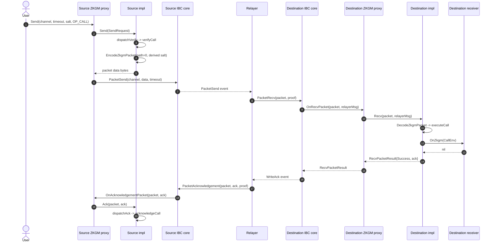

# ZKGM v1 App Spec

This document describes the current ZKGM v1 implementation. It covers the
proxy realm under
[gno.land/r/core/ibc/v1/apps/zkgm](../../../gno.land/r/core/ibc/v1/apps/zkgm),
the active implementation under
[gno.land/r/core/ibc/v1/apps/zkgm/v0/impl](../../../gno.land/r/core/ibc/v1/apps/zkgm/v0/impl),
and the stateless ZKGM package under
[gno.land/p/core/ibc/zkgm](../../../gno.land/p/core/ibc/zkgm), which provides
ABI types, instruction constants, salt and path helpers, and interface
definitions.

ZKGM realms publish under the `gnoswap` namespace even though their filesystem
location uses `core/`. See [Architecture](../architecture.md#realm-topology) for
the canonical module-path table.

## Scope

ZKGM is implemented as a stateful proxy realm plus an implementation realm. The
proxy owns all persistent app state, registers with IBC core, exposes public
send and admin entry points, and delegates instruction behavior to the active
implementation. The `v0/impl` realm contains the current dispatcher and opcode
handlers.

The public app surface includes:

- `Send` for structured ZKGM instructions
- `SendRaw` for CLI-friendly primitive arguments
- IBC app callbacks for channel lifecycle, receive, intent receive,
  acknowledgement, and timeout
- proxy state management through implementation, admin, receiver, ledger, and
  forward acknowledgement helpers

The channel version is `ucs03-zkgm-0`. `OnChannelOpenInit` and
`OnChannelOpenTry` reject any other local version. `OnChannelOpenTry` also
checks the counterparty version.

## Minimal OP_CALL Flow

`OP_CALL` is the smallest ZKGM instruction. It carries application calldata to a
registered receiver realm on the destination chain. It does not move tokens,
does not batch child instructions, and does not change channel topology.

A user calls the source ZKGM proxy with
`Instruction{Version: INSTR_VERSION_0, Opcode: OP_CALL, Operand: Call}`. The
proxy delegates verification and packet encoding to the active implementation,
then asks IBC core to commit the packet. A relayer delivers the packet to the
destination chain. Destination core verifies the source packet commitment,
dispatches `OnRecvPacket` to the destination ZKGM proxy, and the proxy delegates
to `impl.Recv`. The implementation decodes the packet, executes `OP_CALL`,
looks up the registered receiver at `Call.ContractAddress`, and invokes
`receiver.OnZkgm`. The receiver result is wrapped in a ZKGM acknowledgement and
committed by destination core as a synchronous ack. A relayer then returns that
ack to source core, which calls source ZKGM `Ack`. Plain `OP_CALL` keeps no
source-side in-flight state, so its acknowledgement handler is a no-op unless
the rejected `Eureka` mode is present.

Reading rules:

- Source and destination ZKGM proxies use the same module path, deployed on
  opposite chains.
- Source and destination implementations use the same `v0/impl` package,
  deployed on opposite chains.
- The destination receiver is any realm that registered itself with
  `RegisterReceiver`.
- Core proof verification is the standard packet flow from
  [IBC v1 Core](../ibc-v1-core/README.md). The sequence above focuses only on
  ZKGM-specific dispatch.

The send phase is covered by [Sending Packets](./sending-packets.md). Receiver
registration and `CallEnv` fields are covered by
[Receiver Registry](./receiver-registry.md). Opcode routing is covered by
[Instruction Dispatch](./instruction-dispatch.md), and the detailed `OP_CALL`
semantics are covered by [Salt, Path, and Call](./salt-path-and-call.md). Wire
envelope layout is covered by [Wire Encoding](./wire-encoding.md).

## Module Reference

| File | Topic |
| --- | --- |
| [Proxy and Implementation](./proxy-and-impl.md) | Proxy state, impl pointer, authorization |
| [Sending Packets](./sending-packets.md) | Send entry point and packet construction |
| [Receiver Registry](./receiver-registry.md) | Receiver registration and `CallEnv` |
| [Instruction Dispatch](./instruction-dispatch.md) | Opcode dispatch helpers |
| [Wire Encoding](./wire-encoding.md) | Envelope, operand, ack, and path encoding |
| [Salt, Path, and Call](./salt-path-and-call.md) | Salt and path derivation, `OP_CALL` semantics |
| [Token Order](./token-order.md) | `TokenOrderV2`, predicted denoms, and channel balances |
| [Batch and Forward](./batch-and-forward.md) | `OP_BATCH` and `OP_FORWARD` execution |
| [Rate Limiting and Admin](./rate-limiting-admin.md) | Per-denom buckets, admin entry points, pause semantics |
| [Surface and Deltas](./surface-and-deltas.md) | Queries, events, and differences from Union |
