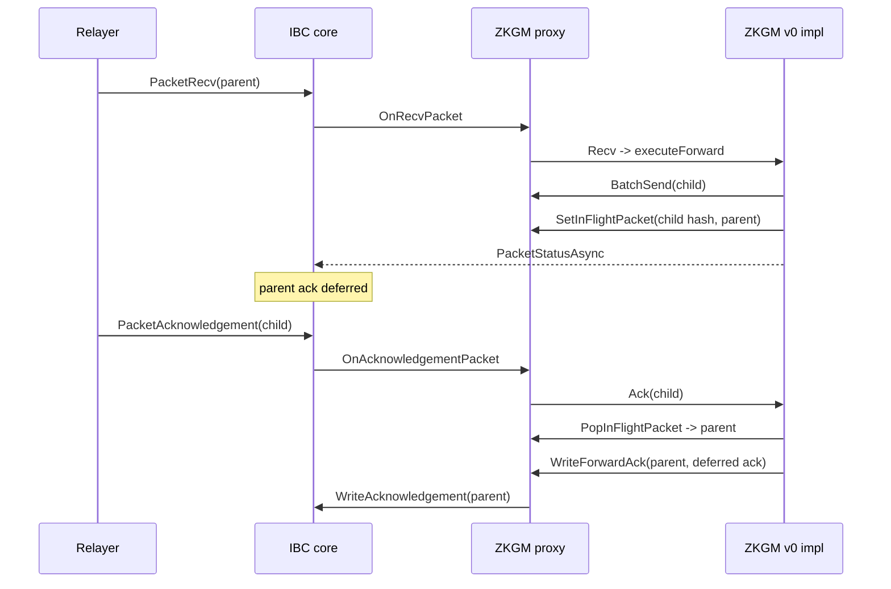

# Channel Balance Accounting

Channel balances use this key shape:

```text
{channelId}/{path}/{hex(baseToken)}/{hex(quoteToken)}
```

`channelId` uses `ChannelId.String()`. `path` uses `u256.ToString()`. Token
fields are hex-encoded without a `0x` prefix.

The balance represents source-side escrow for a token order. Increases happen
when `INITIALIZE` or `ESCROW` send-side verification accepts a token movement.
Decreases happen when an `UNESCROW` receive path releases native tokens or when
refund and market-maker settlement paths release escrowed base tokens.

When a balance drops to zero, the implementation removes the key from
`channelBalanceV2`.

## Batch Instructions

Batches are restricted to `OP_CALL` and `OP_TOKEN_ORDER` children. Nested
`OP_BATCH` and `OP_FORWARD` children are rejected.

Verification derives a child salt for each child and recursively calls
`dispatchVerify`.

Execution derives child salts, recursively calls `dispatchExecute`, and
collects child acknowledgements. A child that returns `ACK_ERR_ONLY_MAKER`
aborts the batch immediately and returns `ACK_ERR_ONLY_MAKER` as the parent
acknowledgement. Already executed child state changes are not rolled back.

Successful batch execution returns:

```text
Ack{Tag: TAG_ACK_SUCCESS, InnerAck: EncodeBatchAck(BatchAck{Acknowledgements})}
```

Batch ack handling decodes the outer ack. On success, the number of child acks
must match the number of child instructions. On outer failure, the implementation
passes `universalErrorAck()` to each child so token-order children can refund.

Timeout handling dispatches timeout to each child with its derived child salt.

## Forward Instructions

Forward children may be `OP_CALL`, `OP_TOKEN_ORDER`, or `OP_BATCH`. Direct
`OP_FORWARD` children are rejected by verify and execute.

Forward verify checks the child opcode, enforces the maximum hop count of 8
defined as `MaxHops` in the ABI package, derives the forward salt, and verifies
the child instruction against the forward path.

Forward execute builds a child packet, sends it through proxy `BatchSend` as a
one-packet batch, stores the parent packet under the child packet commitment,
and returns `PacketStatusAsync` to IBC core.

Child construction dequeues the previous destination channel and next source
channel from `Forward.Path`. The previous destination must match the current
packet destination channel. If the residual path is non-zero, the implementation
wraps the child instruction in another `Forward` for continuation. The child
packet uses `DeriveForwardSalt(parentSalt)`.

When a child acknowledgement or timeout returns, `handleForwardChild` checks
`IsForwardedPacket`. If the salt is marked as forwarded, the implementation
pops the in-flight parent packet and calls `WriteForwardAck(parent, ack)`, which
routes to IBC core `WriteAcknowledgement`.

Example emission:

```json
{
  "type": "WriteAck",
  "attrs": [
    {
      "key": "packet_hash",
      "value": "0x1111...111111"
    },
    {
      "key": "packet_data",
      "value": "0x1111...0801..."
    },
    {
      "key": "source_channel_id",
      "value": "27"
    },
    {
      "key": "source_connection_id",
      "value": "3"
    },
    {
      "key": "source_connection_client_id",
      "value": "7"
    },
    {
      "key": "destination_channel_id",
      "value": "1"
    },
    {
      "key": "destination_channel_version",
      "value": "ucs03-zkgm-0"
    },
    {
      "key": "destination_connection_id",
      "value": "1"
    },
    {
      "key": "destination_connection_client_id",
      "value": "1"
    },
    {
      "key": "timeout_timestamp",
      "value": "1750000000000000000"
    },
    {
      "key": "acknowledgement",
      "value": "0x0a20...c1d0"
    }
  ],
  "pkg_path": "gno.land/r/core/ibc/v1/core"
}
```

The `acknowledgement` carries the resolved child ack, which the forward handler
popped from the in-flight table when the child packet acknowledged or timed out.
The packet identity in `packet_hash` and `packet_data` is the parent packet's
identity, not the child's.

On intent receive, `OP_FORWARD` returns `PacketStatusSuccess` with
`ACK_ERR_ONLY_MAKER` and does not send a child packet.

The current forward child send mechanism uses `BatchSend`, not direct
`PacketSend`. That means a forwarded child is surfaced through the core batch
send path.


