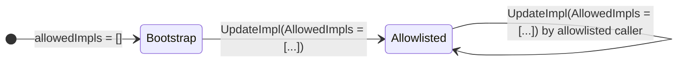

# Proxy State

All durable ZKGM state lives in the proxy realm. The active implementation is
stateless apart from the package-level `ZkgmV1` singleton.

Proxy state is organized into these categories:

- **Implementation pointer and authorization settings.** Active implementation
  object, the package path that installed it, the implementation whitelist, the
  global pause flag, the cached proxy realm address, and the admin address.
  Defined in [`proxy.gno`](../../../gno.land/r/core/ibc/v1/apps/zkgm/proxy.gno).
- **Receiver registry.** Maps pkgpaths to `Zkgmable` receivers. Defined in
  [`proxy.gno`](../../../gno.land/r/core/ibc/v1/apps/zkgm/proxy.gno).
- **Ledger maps.** Wrapped-denom origin paths, metadata image lookups, and
  per-channel escrow balances. Defined in
  [`ledger.gno`](../../../gno.land/r/core/ibc/v1/apps/zkgm/ledger.gno).
- **In-flight bookkeeping.** Maps forwarded child packet hashes to parent
  packets. Defined in
  [`ledger.gno`](../../../gno.land/r/core/ibc/v1/apps/zkgm/ledger.gno).
- **Rate limiting.** Per-denom token buckets and a global kill switch. Defined
  in [`ledger.gno`](../../../gno.land/r/core/ibc/v1/apps/zkgm/ledger.gno).

> **`channelBalanceV2` is the only channel-balance store.**
> The committed codebase does not contain a `channelBalanceV1` store. The `V2`
> suffix is part of the store name and does not imply parallel V1 and V2
> implementations.

## Implementation Pointer

The proxy can replace its active implementation through `UpdateImpl`. The call
is allowed when `allowedImpls` is empty (bootstrap mode) or the previous realm
pkgpath is already listed in `allowedImpls`. A non-nil `AllowedImpls` value
replaces the whitelist. A non-nil `Impl` value replaces the active
implementation and records the caller pkgpath in `implPath`.

The loader seeds the proxy with allowed paths for IBC core, the proxy, the
loader, and the v0 implementation. It then registers the proxy app with IBC
core under `zkgm.ProxyPkgPath()`.

`GetInstance` in the implementation realm is loader-only. Calls from any other
previous realm panic.

## Authorization Model

ZKGM uses four authorization styles.

`mustBeAuthorizedImpl(cur)` gates ledger writes. It accepts any caller whose
pkgpath is in `allowedImpls`. It protects token origin, metadata image, channel
balance, in-flight packet, token bucket setter, token bucket remover, and
`RateLimit` calls.

`requireImplCaller(cur, action)` gates proxy actions that move state or funds on
behalf of the implementation. It accepts the registered `implPath` and entries
in `allowedImpls`. It protects `WriteForwardAck` and `ReleaseNative`.

`BatchSend` is implementation-only, with explicit test realm bypasses for the
existing e2e and real CometBLS scenario packages. The bypasses are hardcoded
for the `testing/e2e` and `testing/realcometbls` package paths.

Admin operations use `mustBeAdmin`. When `adminAddressStr` is empty, bootstrap
calls are allowed. Once set, admin calls require an origin call and the origin
caller must match `adminAddressStr`.

Native `Send` and `SendRaw` require an EOA call frame. They read
`OriginSend()` only when `cur.Previous().IsUserCall()` is true and then call
`runtime.AssertOriginCall()` before using `OriginCaller()` as the ZKGM sender.
